# 松江区泗泾04-08号地块

# 投资分析报告

# 目录

PART1项目概况

PART2市场竞争分析

PART3客户及定位分析

PART4设计方案

PART5运营计划

PART6投资测算

# 01 项目概况

# 1.1 基本指标及大小区位

■ 地块位于松江区泗泾板块，外郊环之间，距离9号线泗泾站步行1.3km，距虹桥商务区10km，距七宝商圈（七宝万科广场、宝龙广场）10km，距离徐家汇19km，交通网络发达，市区来往便利。  
金地深耕松江泗泾，地块周边多金地开发的住宅小区。周边商业、教育、医疗设施完善，居住氛围浓厚。

<table><tr><td>地块名称</td><td>板块</td><td>用地性质</td><td>占地（㎡）</td><td>容积率</td><td>计容（㎡）</td><td>预计起拍总价
（万）</td><td>预计起拍楼板价
（元/㎡）</td><td>中止价
（万元）</td><td>中止楼板价
（元/㎡）</td><td>中止价
溢价率</td><td>保证金
（万元）</td><td>预计出让时间</td></tr><tr><td>松江区泗泾04-08号地块</td><td>泗泾</td><td>二类住宅</td><td>19372</td><td>1.2</td><td>23246.4</td><td>53466.72</td><td>23000</td><td>69506.736</td><td>29900</td><td>30%</td><td>10693</td><td>2026年3-4月</td></tr></table>

# 1.2 用地条件分析：用地红线图及控规

■ 地块四至：东至刘五公路、南至达州路、西至横港河、北至横港河，两面临河、河宽13米，整体环境静谧，适宜打造低密产品。

# 主要规划条件：

1、限高：24米。5%保障房（可沟通取消）。  
2、绿建二星，BIM应用，海绵城市。  
3、装配式建筑面积的比例为： $100\%$ 。建筑单体预制率 $40\%$ 或建筑单体装配率 $60\%$ 。  
4、屋顶安装太阳能光伏的面积比例：不低于  $30\%$  。  
5、精装修比例：100%

# 1.3 交通分析

■ 轨交：地块距离地铁9号线泗泾站约1.3公里。  
■道路：地块临近泗陈公路、嘉松路，可快速通达九亭、松江城区及青浦赵巷；通过沪渝高速、沈海高速通达长三角城市群。

<table><tr><td>地铁</td><td>途径区域</td><td>换乘</td></tr><tr><td>9号线</td><td>七宝、漕河泾开发区、徐家汇、陆家嘴、世纪大道</td><td>1、2、4、6、11、13号线</td></tr></table>

# 1.4 周边配套：商业、学校、医院配套完善，生活氛围浓厚

■ 地块靠近金地自在城项目，周边商业、教育、医疗设施成熟，居住氛围浓厚。  
商业：招商花园城（26年底开业，总建面约20万方）、三湘商业广场、大润发等大型购物广场。  
√ 教育：石桥幼儿园、泗泾三小、泗泾四中、上师大附属松江实验学校。  
✓ 医疗：泗泾医院（二甲）。  
其他：距离余山度假区仅1站地铁路程，靠近余山有东方索菲特大酒店、欢乐谷；2公里处有泗泾公园。

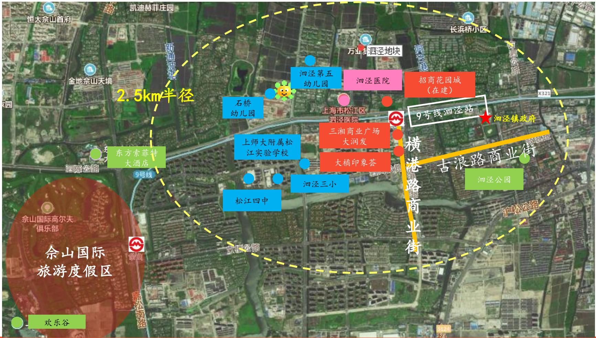

# 教育配套

石桥幼儿院

泗泾三小

泗泾四中

上师大附属松江实验学校（九年一贯制）

# 医疗配套

泗泾医院（二甲）

# 商业配套

招商花园城(26年底开业，总建面约20万方)

三湘商业广场

大润发

嘉宏·大橘印象荟

# 其他

余山国际旅游度假区

泗泾公园

# 1.5 学区配套：项目大概率未来对口上师大实验学校（公办二梯队）

■ 本地块周边的同济晶萃（青松社区）和山水四季城（金地一村）均对口上师大附属松江实验学校（二梯队，九年一贯制）。

<table><tr><td colspan="15">松江区名额分配到校【沪上房校通】</td><td></td></tr><tr><td rowspan="2">学校</td><td rowspan="2">委属到校分数线</td><td colspan="3">华二松江</td><td colspan="3">松江二中</td><td colspan="3">上外云间</td><td colspan="3">松江一中</td><td rowspan="2">到校均分 排序</td><td></td></tr><tr><td>2024计划</td><td>2024分数线</td><td>2023分数线</td><td>2024计划</td><td>2024分数线</td><td>2023分数线</td><td>2024计划</td><td>2024分数线</td><td>2023分数线</td><td>2024计划</td><td>2024分数线</td><td>2023分数线</td><td></td></tr><tr><td>上师大松实</td><td></td><td>1</td><td>709</td><td>700.5</td><td>2</td><td>696</td><td>693.5</td><td>3</td><td>685</td><td>695</td><td>3</td><td>671</td><td>672.5</td><td>690.25</td><td>1</td></tr><tr><td>上外松外</td><td>上中713</td><td>3</td><td>707.5</td><td>702</td><td>12</td><td>694</td><td>694.5</td><td>11</td><td>687.5</td><td>690</td><td>11</td><td>669</td><td>675</td><td>689.5</td><td>2</td></tr><tr><td>华政松实</td><td>交附710</td><td>2</td><td>704</td><td>697</td><td>8</td><td>695</td><td>693</td><td>9</td><td>685</td><td>681</td><td>8</td><td>668.5</td><td>676</td><td>688.125</td><td>3</td></tr><tr><td>工技大泗实</td><td></td><td>1</td><td>705.5</td><td></td><td>3</td><td>697.5</td><td></td><td>3</td><td>682</td><td></td><td>2</td><td>667</td><td></td><td>688</td><td>4</td></tr><tr><td>九峰实验</td><td></td><td>2</td><td>707</td><td></td><td>9</td><td>696.5</td><td></td><td>8</td><td>679.5</td><td></td><td>9</td><td>664</td><td></td><td>686.75</td><td>5</td></tr><tr><td>东华附校</td><td></td><td>3</td><td>702.5</td><td>700.5</td><td>9</td><td>692.5</td><td>691</td><td>q</td><td>684.5</td><td>685</td><td>10</td><td>667</td><td>679.5</td><td>686.625</td><td>6</td></tr><tr><td>新闵学校</td><td></td><td>1</td><td>706.5</td><td>706.5</td><td>6</td><td>690.5</td><td>688.5</td><td>5</td><td>682</td><td>686</td><td>5</td><td>667.5</td><td>669.5</td><td>686.625</td><td>7</td></tr><tr><td>民乐学校</td><td>上师692.5</td><td>2</td><td>708</td><td>705.5</td><td>7</td><td>696.5</td><td>694.5</td><td>7</td><td>677</td><td>683.5</td><td>7</td><td>664</td><td>676.5</td><td>686.375</td><td>8</td></tr><tr><td>三新东校</td><td></td><td>3</td><td>697</td><td>699.5</td><td>9</td><td>690.5</td><td>685.5</td><td>8</td><td>684.5</td><td>679.5</td><td>9</td><td>673.5</td><td>672.5</td><td>686.375</td><td>9</td></tr><tr><td>松江七中</td><td></td><td>5</td><td>700</td><td>696</td><td>13</td><td>691.5</td><td>690.5</td><td>14</td><td>680</td><td>684.5</td><td>14</td><td>671.5</td><td>677</td><td>685.75</td><td>10</td></tr><tr><td>葦一中学</td><td></td><td>2</td><td>702.5</td><td></td><td>7</td><td>690.5</td><td></td><td>7</td><td>680</td><td></td><td>7</td><td>668</td><td></td><td>685.25</td><td>11</td></tr><tr><td>三新学校</td><td></td><td>3</td><td>700.5</td><td>706.5</td><td>8</td><td>695.5</td><td>695.5</td><td>8</td><td>679.5</td><td>687</td><td>9</td><td>664.5</td><td>676.5</td><td>685</td><td>12</td></tr><tr><td>东华附小昆山</td><td></td><td>1</td><td>694</td><td>685.5</td><td>2</td><td>692</td><td>682</td><td>2</td><td>682</td><td>678</td><td>2</td><td>671</td><td>677</td><td>684.75</td><td>13</td></tr><tr><td>西外外国语</td><td>上师677.5</td><td>2</td><td>707.5</td><td></td><td>7</td><td>686.5</td><td></td><td>6</td><td>677.5</td><td></td><td>6</td><td>666</td><td></td><td>684.375</td><td>14</td></tr><tr><td>九亭中学</td><td></td><td>3</td><td>702</td><td>697.5</td><td>12</td><td>689</td><td>694</td><td>12</td><td>679</td><td>683</td><td>12</td><td>666.5</td><td>675</td><td>684.125</td><td>15</td></tr></table>

<table><tr><td colspan="4">2024松江中考各学校700+情况</td></tr><tr><td>学校</td><td>700+人数</td><td>考生估计</td><td>700+比例</td></tr><tr><td>上外松外</td><td>36</td><td>410</td><td>8.78%</td></tr><tr><td>民乐学校</td><td>21</td><td>250</td><td>8.40%</td></tr><tr><td>三新学校</td><td>22</td><td>300</td><td>7.33%</td></tr><tr><td>工程大</td><td>7</td><td>100</td><td>7.00%</td></tr><tr><td>九峰实验</td><td>21</td><td>310</td><td>6.77%</td></tr><tr><td>东华附校</td><td>22</td><td>330</td><td>6.67%</td></tr><tr><td>华政附校</td><td>18</td><td>300</td><td>6.00%</td></tr><tr><td>上师大松实</td><td>6</td><td>100</td><td>6.00%</td></tr><tr><td>西外外国语</td><td>12</td><td>230</td><td>5.22%</td></tr><tr><td>余山外国语</td><td>3</td><td>75</td><td>4.00%</td></tr><tr><td>对外经贸</td><td>13</td><td>345</td><td>3.77%</td></tr></table>

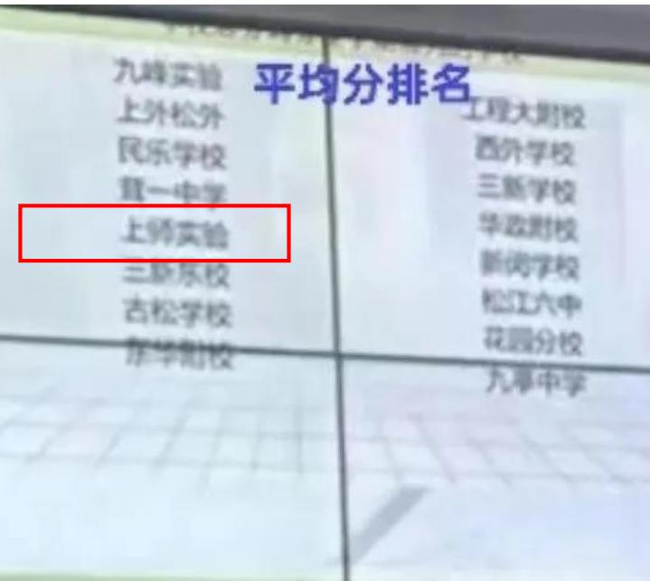

1.6 红线外不利因素  

<table><tr><td>不利因素</td><td>有画勾</td><td>不利因素描述,及到项目红线距离</td><td>对方案成本的影响</td><td>对客户的影响</td></tr><tr><td>噪音、污染、恶臭(机场、铁路、公路、立交桥、工厂、集市、学校、车站、货场、造纸厂、化工厂、橡胶厂、废品站、产生烟雾和扬尘的场所、垃圾场、污水河/塘/沟渠等)</td><td>无</td><td></td><td></td><td></td></tr><tr><td>宗教、禁忌(庙宇、教堂、清真寺、殡仪馆、火葬场、公墓、监狱或看守所、刑场等)</td><td>无</td><td></td><td></td><td></td></tr><tr><td>危险物及辐射(高压电线路、变电站、雨污水泵站、核电站、油气库站、弹药库、微波通道、无线通讯基站、高铁、辐照中心等)</td><td>无</td><td></td><td></td><td></td></tr><tr><td>环境变迁(规划中的公路、道路、高架桥、铁路建设;绿地、水面、树林等改变现状)</td><td>无</td><td></td><td></td><td></td></tr><tr><td>地下状况(地下管线、电缆、暗渠、水渠、沟壑、池塘、地下有原建筑物桩基或其他建筑物构筑物)</td><td>无</td><td></td><td></td><td></td></tr><tr><td>地表状况(地表有堆土、坑池、地表现状建筑物、保留或拆除物、林木、青苗、鱼塘等,以及是否完成相应补偿)</td><td>无</td><td></td><td></td><td></td></tr><tr><td>属于填湖、填海地块、是否临湖/河/江/海</td><td>无</td><td></td><td></td><td></td></tr></table>

# 02 市场竞争分析

# 2.1 上海土拍、销售市场政策

■ 土拍政策：24年土拍政策做了2次调整：①从三批次（6月）开始，取消房地价联动和竞高品质住宅，价高则得【之前是设置房地价联动，达到最高价后摇号】。②从五批次（8月）开始，改为“双高双竞”政策。第一阶段现场自由竞价，设置中止价；第二阶段开始竞高品质住宅。

■ 销售政策：①24年上海销售市场调控政策整体与北京等一线城市同频共振，主要出台了527和929政策：核心内容是放松限购和降低房贷利率。25年8月调控政策主要是：放开外环外限购及商贷利率不再区分首套二套。

土拍政策  

<table><tr><td colspan="2">具体政策</td><td>具体规定</td></tr><tr><td rowspan="5">报名阶段</td><td>报名/保证金截止时间</td><td>地块正式公告后约25天报名/保证金截止</td></tr><tr><td>资金冻结时间</td><td>报名截止后第1天冻结竞买资金</td></tr><tr><td>竞拍时间</td><td>报名截止后地2天开始竞拍</td></tr><tr><td>竞买人资格</td><td>①房地产开发资质
②同一集团单一报名主体</td></tr><tr><td>资金需求</td><td>①全额土地款：保证金【起拍价20%】+冻结资金。
②竞得后保证金不可直接抵作土地款，第一笔土地款缴清后5个工作日内退回。
③自有资金报名前事务所审核盖章。</td></tr><tr><td colspan="2">竞拍</td><td>双高双竞【价高者得】
①第一阶段：自由竞价到中止价【溢价率30-40%】后竞高品质指标（装修标准→公共服务设施面积→高端人才房配建比例）。若不到中止价，价高则得。
②第二阶段：竞价到高品质上限后，继续现场竞价，价高者得。</td></tr><tr><td colspan="2">土地款支付</td><td>①第一笔：20%土地款（从冻结资金里直接转账）。土地合同签订5个工作日。
②第二笔：30%土地款（从冻结资金里直接转账）。土地合同签订30日内。（一般都会和第一笔一起支付，因为土地款支付到50%，冻结资金的剩余资金可以解冻调走）。
③第三笔：50%土地款。土地合同签订30个工作日。</td></tr></table>

销售市场政策  

<table><tr><td>具体政策</td><td>具体规定</td></tr><tr><td>限购</td><td>①本市户籍单身/家庭：外环内限购2套，多孩家庭可增购1套。外环外不限购。
②非户籍外地单身/家庭（居住证不满120或社保不满3年）：3年社保外环内限购1套，多孩家庭可增购1套。外化外不限购。
③非户籍外地单身/家庭（居住证积分满120分且社保满3年）：外环内限购2套，多孩家庭可增购1套。外环外不限购。</td></tr><tr><td>限贷</td><td>①首付：首套15%，二套25%（外围区域20%）。
②利率：3.05%（不区分首套二套）。</td></tr><tr><td>限价</td><td>无</td></tr><tr><td>限售</td><td>新房认筹比超130%触发限售（网签后5年之内限售）</td></tr><tr><td>限签</td><td>无</td></tr><tr><td>预售政策</td><td>实际执行有所放松，出正负零即可预售</td></tr><tr><td>放款政策</td><td>主体结构封顶放款</td></tr></table>

# 2.1 上海土拍、销售市场政策

资金监管政策  

<table><tr><td colspan="2">最新监管政策</td><td>测算模型假设</td></tr><tr><td rowspan="2">监管工程款额度核定</td><td>工程建设费用额度：第三方造价咨询机构核定工程建设费用（包含公建配套）*1.2</td><td>工程建设费用额度：含税（前期+毛坯）建安成本*1.2</td></tr><tr><td>全装修费用额度：根据预售合同约定金额核定</td><td>全装修费用额度：含税精装建安成本</td></tr><tr><td>监管税金额度核定</td><td>全部预售款*8%</td><td>不含税住宅销售收入*8%</td></tr><tr><td rowspan="3">监管额度内资金支取</td><td>工程建设费用额度：根据工程节点逐步释放
① 完成主体结构二分之一，留存比例不低于该额度的60%;
② 完成主体结构封顶，留存比例不低于该额度的40%;
③ 完成分户验收，留存比例不低于该额度的20%;
④ 完成交付使用许可，留存比例不低于该额度的5%;
⑤ 完成不动产首次登记，可支取工程建设额度内剩余资金</td><td>工程建设费用额度：根据工程节点逐步释放
① 完成主体结构二分之一，提取40%;
② 完成主体结构封顶，提取20%;
③ 完成分户验收，提取20%;
④ 完成交付使用许可，提取15%;
⑤ 完成不动产首次登记，提取5%</td></tr><tr><td>全装修费用额度：在分户验收后一次性释放</td><td>全装修费用额度：完成分户验收，提取100%</td></tr><tr><td>监管税金額度：按照税务部门出具的证明材料直接拨付税务部门</td><td>监管税金額度：按照每个季度实际支付税金对应提取直至提取完毕</td></tr><tr><td>备注</td><td></td><td>若当季度监管额度&gt;销售收入，则后一季度整体已实现销售收入达到核定监管额度后才可提取监管资金</td></tr></table>

# 2.2 土地市场：土地成交量有所回落，至18-19年水位

25年上海土地市场成交住宅建面约444万  $\mathfrak{m}^2$  ，基本回到19年的水平。25年土地成交均价上升至54895元/m²，主要原因是中环内供地量大幅上升，导致价格结构性上涨。

  
上海历年土地成交情况

  
上海土地出让结构

# 2.3 松江城市规划：松江区是五大新城之一，虹桥国际开放枢纽“南向拓展带”核心承载区

五大新城：松江区作为上海西南门户和“上海之根”，是长三角G60科创走廊策源地和上海国际科创中心核心承载区，承载着先进制造业发展集聚区、新质生产力先行区等战略定位，是五大新城中人口与高学历人才集聚的样板区。经济上，其规上工业企业数量连续多年居全市第一，属地规上工业产值、进出口总额位列全市第二，集聚腾讯智算中心等重大项目，算力规模约占全市  $50\%$  。  
承接虹桥：松江区是虹桥国际开放枢纽“南向拓展带”核心承载区，北部九里亭、九亭、泗泾、洞泾、新桥、余山等6个街镇纳入虹桥535平方公里协同发展范围，承接大商务、大会展、大科创资源外溢，打造虹桥南向“科创+商务+文旅”功能延伸极。  
■ 板块定位：松江以“一廊一轴两核”为骨架，形成“新城核心引领、板块错位协同”的格局，核心发展重点集中在松江新城、洞泾、泗泾、九亭、松江工业区。

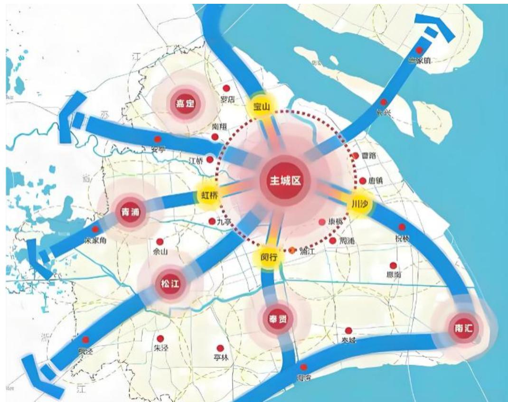  
上海五大新城地图

  
松江区域城乡体系地图

2.3 松江区板块划分及价值梯度：松江区呈现典型的哑铃式结构：九亭、松江新城位于板块价值第一梯队；中段泗泾、洞泾位于第二梯队；松江老城、新桥、余山等偏外围板块属于第三梯队，小昆山、车墩位于第四梯队。

■ 第一梯队：松江新城，为松江发展的核心，配套和城市建设成熟、规划能级高，5.1-5.8w；九亭板块成熟但老旧，5.7-6.7w（暂无新盘）；  
■ 第二梯队：地块所属的泗泾板块，处于松江第二价值梯队，为强轨交外溢的成熟板块，高层售价4.4-5.1w，洞泾仍在发展中，4.2-4.6w。  
■ 第三梯队为松江老城、新桥、余山板块，4.2-4.7w，均无轨交，偏内生市场或自驾客为主。  
■ 第四梯队为小昆山、车墩，松江价格最低区，售价3.0-3.7w，承接松江及外区低总价上车客户。

  
2025年松江各板块代表高层均价

# 第一梯队

# [松江新城]

松江新城核心，松江价格高地，5.1-5.8w

# [九亭]

紧邻闵行、虹桥，轨交一站直达，5.7-6.7w

# 第二梯队

# [泗泾]

近闵行轨交板块、发展成熟、外溢客为主 4.4-5.1w

# [洞泾]

近闭行双轨交板块、发展成长中4.2-4.6w

# 第三梯队

# [松江老城]

本地客为主，较为封闭，4.3-4.7w

# [余山]

度假区、别墅区、大居，4.2-4.7w

# [新桥]

客源有限，无在售

# 第四梯队

[小昆山] [车墩] 3.0-3.7w

松江价格最低区，交通、配套不完善

# 2.3 松江区板块划分及价值梯度：泗泾与洞泾同属第二梯队，两板块均属强轨交外溢板块，存在40-50%左右的客户重叠，具备直接竞争关系，但泗泾板块配套成熟度远优于洞泾，存在明显优势。其他板块与泗泾无直接竞争关系。

<table><tr><td rowspan="2">分类</td><td colspan="2">第一梯队</td><td colspan="2">第二梯队</td><td colspan="3">第三梯队</td><td colspan="2">第四梯队</td></tr><tr><td>松江新城</td><td>九亭</td><td>泗泾</td><td>洞泾</td><td>松江老城</td><td>佘山</td><td>新桥</td><td>小昆山</td><td>车墩</td></tr><tr><td>板块定位</td><td>松江区核心增长极</td><td>虹桥协同发展区</td><td>产城融合示范与 TOD 标杆</td><td>科创转化枢纽</td><td>松江历史文化核心区</td><td>上海老牌生态别墅区</td><td>先进制造业与现代农业融合区</td><td>生态宜居卫星镇</td><td>上海科技影都核心承载区</td></tr><tr><td>板块特征</td><td>松江政治、经济、文化核心,长三角G60科创走廊策源地,配套成熟(教育、医疗、商业完善),规划能级高(如松江枢纽、中山生态商务区)</td><td>紧邻闵行、青浦,是松江“北大门”,交通便捷(9号线直达七宝、徐家汇);人口密集(常住人口约37万),配套成熟</td><td>松江区承接上海外溢第一站,是上海年轻首次置业首选板块,2013年进入供应高峰期以来成交近250万㎡住宅,交通便捷、配套完善</td><td>原为松江工业集中区,居住氛围、生活配套仍在发展中,板块整体价值弱于泗泾。G60科创走廊核心节点,衔接研发与制造,科创载体密集,产业协同性强</td><td>松江的老城区,保留了大量历史建筑,文化底蕴深厚;配套成熟,但城市界面较旧</td><td>以佘山国家旅游度假区为核心,生态资源优越,是上海传统的高端别墅区</td><td>G60科创走廊重要节点,产业升级迅速,交通工程密集推进,产城融合加速</td><td>松江区最为边缘的板块,曾经是工业重镇,交通、配套配套正在完善</td><td>松江区较为边缘的板块,是上海科技影都核心承载区,与市区的交通连接主要依靠金山铁路(3站达上海南站),配套逐步完善中</td></tr><tr><td>产品特征</td><td>以满足板块内原生客群的改善型产品为主</td><td>断供多年</td><td>前期以刚需刚改产品为主,随着板块发展成熟,改善类需求逐步旺盛</td><td>刚需刚改产品为主</td><td>供应量少,以满足板块内原生客群的改善型产品为主</td><td>供应稀缺,现以改善型公寓、洋房为主,部分低密产品</td><td>供应量少,刚需刚改为主</td><td>刚需为主</td><td>刚需、刚改为主</td></tr><tr><td>客群特征</td><td>内生地缘客户90%以上</td><td>本板块客群基数大+闵行、徐家汇外溢刚需改善客群</td><td>全市型外溢刚需改善客群+本板块置换客群基数大</td><td>全市型外溢刚需刚改客群+松江区内刚需刚改客群</td><td>内生地缘客户90%以上</td><td>长宁、虹桥等刚需刚改客群+青浦刚需刚改客群</td><td>承接闵行、莘庄等外溢客群</td><td>全市型+松江区极刚客户</td><td>依托金山铁路导入的市区刚需客户+车墩本地改善客群</td></tr><tr><td>与泗泾客户重叠度</td><td>10%左右</td><td>20%左右九亭无新房供应;如有新房竞争,则与泗泾价差1W+,客群等级有差异</td><td>——</td><td>40-50%左右</td><td>几乎无重叠</td><td>10%左右</td><td>几乎无重叠</td><td>几乎无重叠</td><td>几乎无重叠</td></tr></table>

# 2.4松江土地市场：土地成交量逐年回落，主要供应集中在松江新城、洞泾、泗泾

松江区住宅用地成交呈现“量缩价稳”特征，成交量自2022年触顶后逐年回落，近2年稳定在30万m²左右；平均成交楼面价稳中有升，近年在2.5-2.6万/m²左右；  
主要供应高度集中在松江新城、泗泾、洞泾等少数板块，小昆山、新桥等供地有限，结构性机会集中在核心板块。

松江区住宅用地成交面积、价格  
  
注：1、成交面积为住宅部分计容面积；2、平均楼面价剔除含商办类用地、协议出让用地

松江区住宅用地成交板块分布  

<table><tr><td>年份</td><td>松江新城</td><td>泗泾</td><td>洞泾</td><td>小昆山</td><td>余山</td><td>松江老城</td><td>车墩</td><td>新桥</td><td>九亭</td></tr><tr><td>2016年</td><td>16.8</td><td>12.4</td><td></td><td>9.9</td><td></td><td></td><td></td><td></td><td></td></tr><tr><td>2017年</td><td></td><td></td><td></td><td>19.0</td><td></td><td>1.8</td><td></td><td>5.0</td><td></td></tr><tr><td>2018年</td><td></td><td></td><td>12.1</td><td></td><td></td><td>9.7</td><td></td><td></td><td></td></tr><tr><td>2019年</td><td>3.9</td><td>16.1</td><td></td><td></td><td>8.2</td><td></td><td></td><td></td><td></td></tr><tr><td>2020年</td><td>22.4</td><td>3.9</td><td></td><td></td><td></td><td>6.3</td><td></td><td></td><td></td></tr><tr><td>2021年</td><td>15.1</td><td></td><td>3.1</td><td></td><td>9.7</td><td></td><td>12.7</td><td></td><td></td></tr><tr><td>2022年</td><td>39.8</td><td>15.9</td><td>3.3</td><td>6.4</td><td>10.5</td><td>5.5</td><td>2.3</td><td></td><td></td></tr><tr><td>2023年</td><td>10.2</td><td></td><td>31.7</td><td></td><td></td><td>6.9</td><td></td><td>5.3</td><td></td></tr><tr><td>2024年</td><td>9.2</td><td>16.2</td><td></td><td></td><td>4.8</td><td></td><td></td><td></td><td></td></tr><tr><td>2025年</td><td>15.1</td><td>2.4</td><td>6.6</td><td></td><td></td><td></td><td>6.3</td><td></td><td></td></tr><tr><td>合计</td><td>132.5</td><td>66.8</td><td>56.8</td><td>35.4</td><td>33.1</td><td>30.2</td><td>21.3</td><td>10.3</td><td>0.0</td></tr></table>

# 2.4 土地市场：近年宅地供应显著收缩，后期可开发低密住宅用地稀缺

■ 泗泾板块经历2013-2020年供求热潮、2022年金地&中铁建2幅宅地供应小高峰后，近年宅地供地显著收缩，24-25年仅成交招商1宗、泗泾城市更新1宗地块。板块内库存处于低位，后期可开发低密住宅用地稀缺，存在市场机会。  
■ 本地块起拍楼面价与周边地块相比，预计下降2000元/ $\mathfrak{m}^2$

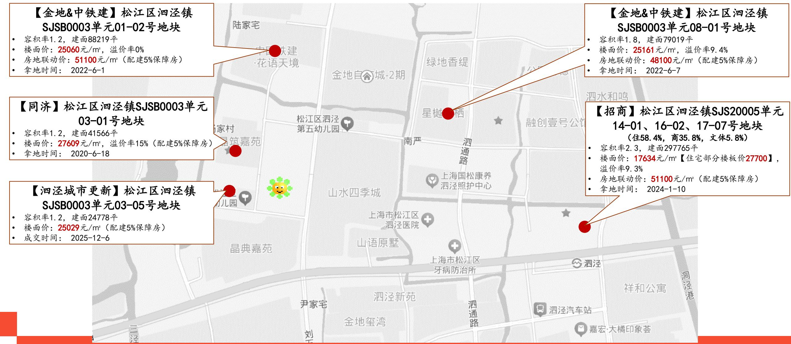

# 2.5住宅市场：松江区连续三年供求缩量，但25年市场供大于求，小库存去化周期逐步攀高至25.5个月，郊区市场略有承压

松江区近10年年均供应67万方，成交78万方，25年供应42万方，成交34万方，供求比1.32，供大于求。  
截至25年12月松江区小库存总量72.7万方，去化周期25.5个月，持续攀升。

  
松江区商品住宅历年供求

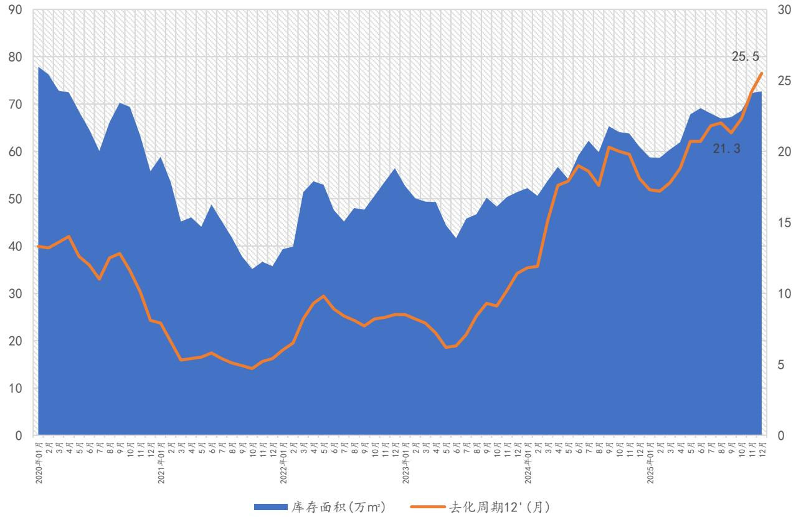  
松江区商品住宅小库存月度走势

# 2.5 住宅市场：松江区公寓以松江新城、泗泾、洞泾板块为成交主力， $90 - 110\mathrm{m}^2$ ，300-600万刚需产品为市场主力； $120 - 140\mathrm{m}^2$ ，500-800万刚改产品为次主力

■近三年松江区各板块中，公寓成交主力为松江新城板块（46%）、泗泾板块（26%）、洞泾板块（17%），板块市场长期活跃，均价约4.5-5.0万/平；  
■近三年松江公寓主力供应及成交为  $90 - 110\mathrm{m}^2$  ，300-600万刚需产品，次主力为  $120 - 140\mathrm{m}^2$  ，500-800万刚改产品。

2023年-2025年松江公寓成交面积段及总价段交叉  

<table><tr><td>面积段</td><td>200万元以下</td><td>200-300万元</td><td>300-400万元</td><td>400-500万元</td><td>500-600万元</td><td>600-700万元</td><td>700-800万元</td><td>800-900万元</td><td>900-1000万元</td><td>1000万以上</td></tr><tr><td>80㎡以下</td><td>32</td><td>200</td><td>571</td><td>14</td><td>0</td><td>0</td><td>0</td><td>0</td><td>0</td><td>0</td></tr><tr><td>80-90㎡</td><td>1</td><td>30</td><td>365</td><td>448</td><td>56</td><td>0</td><td>0</td><td>1</td><td>0</td><td>0</td></tr><tr><td>90-100㎡</td><td>0</td><td>33</td><td>834</td><td>1947</td><td>1075</td><td>11</td><td>0</td><td>0</td><td>1</td><td>0</td></tr><tr><td>100-110㎡</td><td>0</td><td>0</td><td>21</td><td>1255</td><td>1192</td><td>92</td><td>0</td><td>0</td><td>0</td><td>0</td></tr><tr><td>110-120㎡</td><td>0</td><td>1</td><td>0</td><td>14</td><td>65</td><td>23</td><td>19</td><td>0</td><td>0</td><td>0</td></tr><tr><td>120-130㎡</td><td>0</td><td>0</td><td>0</td><td>2</td><td>233</td><td>255</td><td>165</td><td>8</td><td>0</td><td>0</td></tr><tr><td>130-140㎡</td><td>0</td><td>2</td><td>2</td><td>1</td><td>35</td><td>83</td><td>306</td><td>67</td><td>0</td><td>0</td></tr><tr><td>140-160㎡</td><td>0</td><td>1</td><td>0</td><td>0</td><td>3</td><td>43</td><td>135</td><td>174</td><td>138</td><td>1</td></tr><tr><td>160-180㎡</td><td>0</td><td>0</td><td>0</td><td>0</td><td>0</td><td>0</td><td>1</td><td>0</td><td>39</td><td>1</td></tr><tr><td>180-200㎡</td><td>0</td><td>0</td><td>0</td><td>0</td><td>1</td><td>0</td><td>0</td><td>4</td><td>0</td><td>20</td></tr><tr><td>200㎡以上</td><td>0</td><td>0</td><td>0</td><td>0</td><td>0</td><td>3</td><td>1</td><td>0</td><td>0</td><td>4</td></tr></table>

  
松江区各板块公寓2023-2025年成交情况

# 2.5 住宅市场：松江区别墅松江新城、洞泾、余山板块成交活跃，叠加主力400-1100万，联排主力700-1300万，近2年受保利和国贸集中供应联排产品影响（约375套），联排客户短期消耗较快

叠加近三年总供求比1.15，主力总价400-1100万，但800-1100万段的供求比高企，短期供过于求，800万以下小叠加供求关系良好；  
联排近三年总供求比1.19，主力总价700-1300万。  
■ 近2年受保利西郊和煦和国贸海上原墅等集中供应联排产品影响（约375套），联排客户短期消耗较快。

2023年-2025松江区别墅新房总价-分类型价差分析  

<table><tr><td rowspan="2">总阶段</td><td colspan="3">叠加</td><td colspan="3">联排</td><td colspan="3">独栋</td></tr><tr><td>供应套数(套)</td><td>成交套数(套)</td><td>供求比</td><td>供应套数(套)</td><td>成交套数(套)</td><td>供求比</td><td>供应套数(套)</td><td>成交套数(套)</td><td>供求比</td></tr><tr><td>400万元以下</td><td>0</td><td>21</td><td>0.00</td><td>0</td><td>0</td><td>——</td><td>0</td><td>1</td><td>——</td></tr><tr><td>400-500万元</td><td>55</td><td>208</td><td>0.26</td><td>0</td><td>3</td><td>0.00</td><td>0</td><td>0</td><td>——</td></tr><tr><td>500-600万元</td><td>86</td><td>76</td><td>1.13</td><td>0</td><td>11</td><td>0.00</td><td>0</td><td>1</td><td>——</td></tr><tr><td>600-700万元</td><td>96</td><td>97</td><td>0.99</td><td>0</td><td>5</td><td>0.00</td><td>0</td><td>0</td><td>——</td></tr><tr><td>700-800万元</td><td>138</td><td>108</td><td>1.28</td><td>57</td><td>92</td><td>0.62</td><td>0</td><td>0</td><td>——</td></tr><tr><td>800-900万元</td><td>417</td><td>224</td><td>1.86</td><td>84</td><td>68</td><td>1.24</td><td>0</td><td>0</td><td>——</td></tr><tr><td>900-1000万
元</td><td>206</td><td>165</td><td>1.25</td><td>210</td><td>165</td><td>1.27</td><td>0</td><td>3</td><td>——</td></tr><tr><td>1000-1100万
元</td><td>131</td><td>75</td><td>1.75</td><td>82</td><td>52</td><td>1.58</td><td>0</td><td>1</td><td>——</td></tr><tr><td>1100-1200万
元</td><td>7</td><td>15</td><td>0.47</td><td>84</td><td>68</td><td>1.24</td><td>0</td><td>4</td><td>——</td></tr><tr><td>1200-1300万
元</td><td>0</td><td>1</td><td>0.00</td><td>87</td><td>72</td><td>1.21</td><td>0</td><td>2</td><td>——</td></tr><tr><td>1300-1400万
元</td><td>1</td><td>1</td><td>1.00</td><td>47</td><td>31</td><td>1.52</td><td>0</td><td>0</td><td>——</td></tr><tr><td>1400-1500万
元</td><td>0</td><td>0</td><td>——</td><td>29</td><td>15</td><td>1.93</td><td>0</td><td>1</td><td>——</td></tr><tr><td>1500万元以上</td><td>2</td><td>2</td><td>1.00</td><td>38</td><td>21</td><td>1.81</td><td>137</td><td>114</td><td>1.20</td></tr><tr><td>汇总</td><td>1139</td><td>993</td><td>1.15</td><td>718</td><td>603</td><td>1.19</td><td>137</td><td>127</td><td>1.08</td></tr></table>

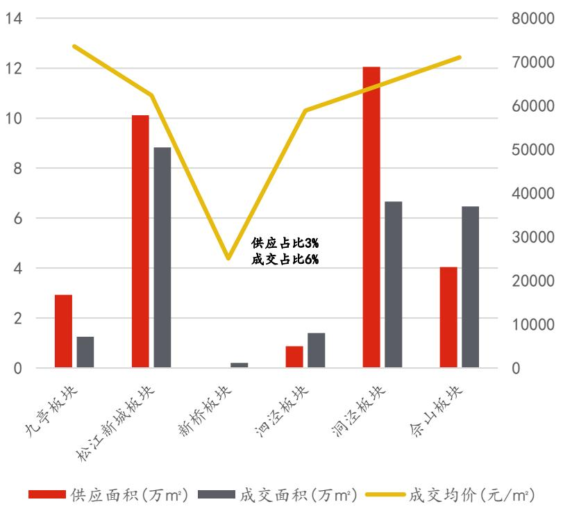  
松江区各板块别墅2023-2025年成交情况

# 2.6 泗泾板块分析：区外多个高能级商务区近距辐射，区内科创产业园环绕

与外区商务区关系上，距离虹桥商务区10km，莘庄商务区11km，与距离松江新城核心10km等距，可被高能级商务区近距离辐射；轨交9号线3站到七宝、6站到漕河泾、9站到徐家汇，是泗泾板块的传统优势。  
■ 在松江区产业关系上，泗泾位于G60科创走廊起始点之一，周边科创产业汇聚，东部、西部有人工智能产业双基地，北部有科创新镇赵巷的市西软信园，南部一路串联松江新城中山街道总部研发功能区。

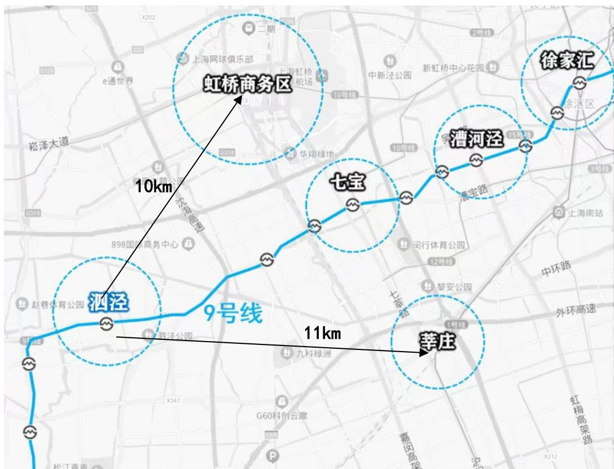

# 2.6 泗泾板块分析：大虹桥扩容被纳入，进一步加强功能和产业联动

■上海官方《虹桥国际中央商务区及周边地区专项规划》的草案公示，面积从151平方公里扩大至约535平方公里，松江首次被扩容进“大虹桥”，涉及地区为九亭镇、泗泾镇、洞泾镇、中山街道、余山镇、新桥镇，共同构成6大专业中心的云麓专业中心，发展新制生产力。

  
大虹桥扩容范围公示草案

规划6处专业中心，以科技创新为核心，支撑新质生产力发展：凤栖专业中心、崧泽专业中心、云麓专业中心、桃浦专业中心、临空专业中心、漕河泾专业中心

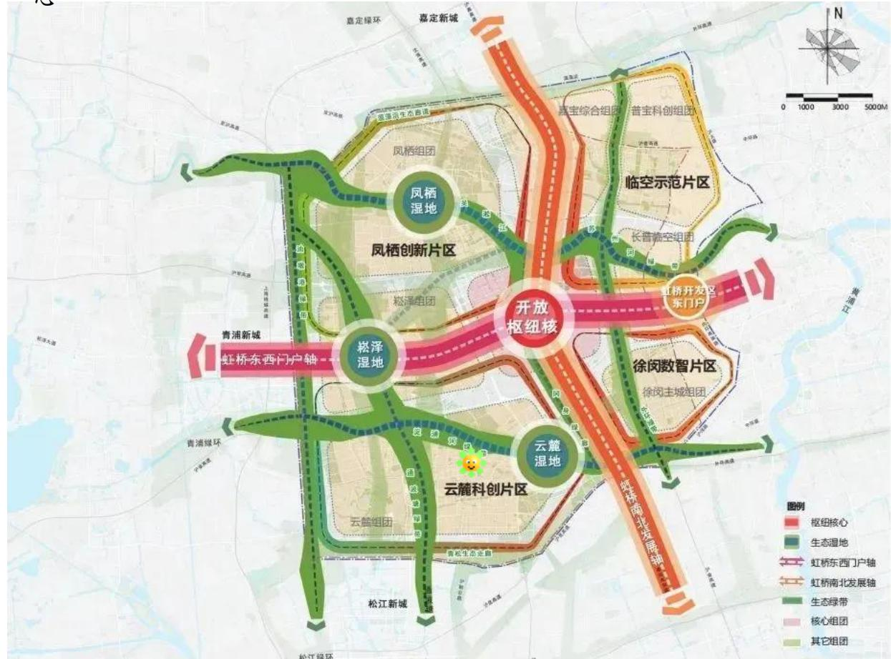  
空间结构规划图

# 2.6 泗泾板块分析：同城镇圈板块中，泗泾最为均衡成熟，适合宜居改善

■根据上海2035规划，松江区两大城镇圈之一，九亭-泗泾-洞泾-新桥城镇圈，以泗泾镇、九亭镇为核心，统筹洞泾镇、新桥镇、九里亭街道，鼓励产业升级转型，关注虹桥商务区功能溢出，做好对虹桥商务区的居住及相关产业配套服务。  
■ 当前泗泾板块各项建设成熟，配套全、能级高、环境好；九亭发展早、品质不高，亟待城市更新；洞泾未来产业规划强但当前公共配套弱。

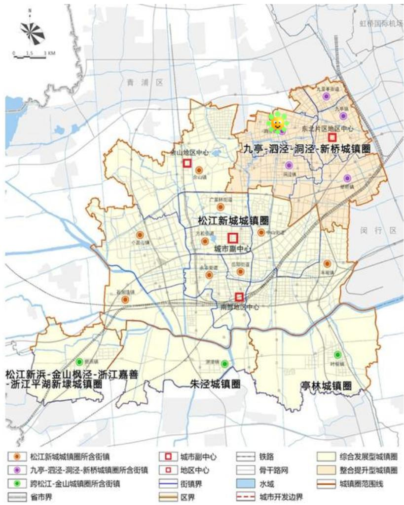

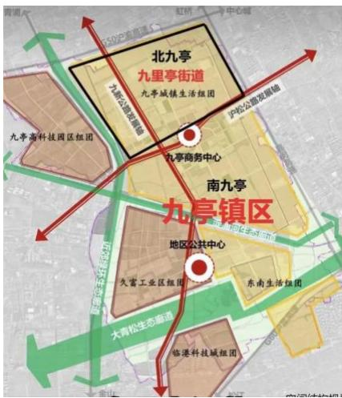

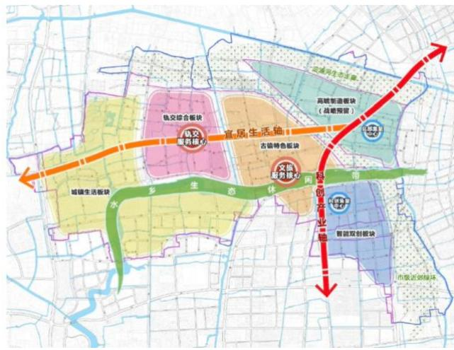

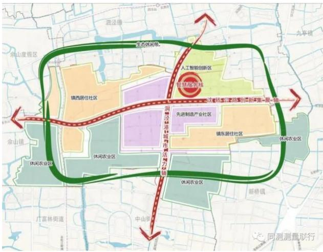

# 九亭：亟待更新

开发建设早，城镇品质不高，工业园区密集，外来人口多，公共配套缺乏

2035建设目标：G60科创走廊的先导区，产城深度融合的示范区，城市有机更新的实践区

学校：九亭小学（二梯队）、九亭四小（三梯队）、九亭中学（三梯队）；

商业：北金地九亭中心、贝尚坊生活中心、南九亭U天地上海青年城；

医疗：九亭医院（二乙）；

绿地：九里亭公园3.5万平方

# 泗泾：均衡成熟

南部成熟，北部发展；公共配套全、能级高，文化生态宜居

2035建设目标：江南古镇、制造强镇、宜居美镇

学校：泗泾小学和松江四中（二梯队）、泗泾实验学校、上师大附属实验、泗泾外国语（均九年一贯）

商业：三湘商业、保利悦活汇、绿地云天坊、招商花园城（在建）

医疗：泗泾医院（二甲）

绿地：泗泾古镇（占地15.52公顷）

# 洞泾：当前配套弱

当前各项配套欠缺，未来科创产业规划强

2035建设目标：未来打造“科创高地、城市客厅、和美家园”三张名片

学校：华师大二附中（九年一贯）

商业：无

医疗：洞泾镇卫生服务中心（一甲）；

绿地：无

# 2.6 泗泾板块：近三年泗泾板块低密产品供应稀缺，24年后仅招商一盘供应，公寓去化率逐步走低，本案建议同期项目错位竞争，主抓改善客

■ 泗泾板块2023年以来供应收缩，至今仅入市新项目6个（含金地&中铁建合作2个），23-24年均仅供应8万方、成交11万方；  
■ 板块中近年低密改善项目供应少，自23Q1的花语天境后一直无别墅供应，新房主要为地铁刚需项目。  
■ 24年至今板块主要在售为招商时代潮派，该盘体量大且占据泗泾地铁站的核心位置，吸附了泗泾及周边九亭、洞泾、佘山等板块的大量轨交刚需客流，建议同期项目错位竞争，主抓改善客。

  
泗泾商品住宅年度量价走势

泗泾板块近三年开盘项目及销售一揽  

<table><tr><td>项目名称</td><td>本次开盘时间</td><td>开盘批次</td><td>本批物业类型</td><td>本期供
应套数</td><td>当天去
化套数</td><td>当天去化率</td><td>本期单价</td></tr><tr><td>同济晶萃二期</td><td>2022年1月24日</td><td>首开</td><td>洋房、联排</td><td>400</td><td>400</td><td>100%</td><td>洋房45666、联排59366</td></tr><tr><td>格力公园海德</td><td>2022年11月14日</td><td>首开</td><td>小高层、复式</td><td>642</td><td>130</td><td>20%</td><td>小高层53500、复式61611</td></tr><tr><td rowspan="4">中铁建&amp;金地花语天境</td><td>2022年10月31日</td><td>首开</td><td>洋房、联排</td><td>442</td><td>294</td><td>67%</td><td>精装洋房49422、毛坯洋房47476、联排62327</td></tr><tr><td>2023年3月29日</td><td>加推</td><td>洋房、联排</td><td>182</td><td>162</td><td>89%</td><td>精装洋房49418、毛坯洋房47311、联排61049</td></tr><tr><td>2023年4月28日</td><td>加推</td><td>洋房</td><td>173</td><td>86</td><td>50%</td><td>精装洋房49411、毛坯洋房47964</td></tr><tr><td>2024年4月16日</td><td>加推</td><td>洋房</td><td>51</td><td>8</td><td>16%</td><td>毛坯洋房47272</td></tr><tr><td rowspan="3">中铁建&amp;金地星樾云栖</td><td>2022年12月15日</td><td>首开</td><td>小高层</td><td>484</td><td>405</td><td>84%</td><td>48090</td></tr><tr><td>2023年3月29日</td><td>加推</td><td>小高层</td><td>210</td><td>210</td><td>100%</td><td>48252</td></tr><tr><td>2024年3月19日</td><td>加推</td><td>小高层</td><td>39</td><td>36</td><td>92%</td><td>47294</td></tr><tr><td rowspan="11">招商时代潮派(在售)</td><td>2024年6月28日</td><td>首开</td><td>小高层</td><td>234</td><td>234</td><td>100%</td><td>49701</td></tr><tr><td>2024年7月28日</td><td>加推</td><td>小高层、洋房</td><td>123</td><td>123</td><td>100%</td><td>49500</td></tr><tr><td>2024年9月15日</td><td>加推</td><td>小高层</td><td>102</td><td>45</td><td>44%</td><td>49803</td></tr><tr><td>2024年10月1日</td><td>加推</td><td>小高层</td><td>146</td><td>31</td><td>21%</td><td>51075</td></tr><tr><td>2024年11月15日</td><td>加推</td><td>高层</td><td>136</td><td>38</td><td>28%</td><td>51664</td></tr><tr><td>2024年12月25日</td><td>加推</td><td>小高层、洋房</td><td>160</td><td>90</td><td>56%</td><td>53168</td></tr><tr><td>2025年2月16日</td><td>加推</td><td>小高层、洋房</td><td>153</td><td>50</td><td>33%</td><td>52377</td></tr><tr><td>2025年3月30日</td><td>加推</td><td>小高层</td><td>81</td><td>24</td><td>30%</td><td>51086</td></tr><tr><td>2025年5月20日</td><td>加推</td><td>小高层</td><td>133</td><td>15</td><td>11%</td><td>50756</td></tr><tr><td>2025年6月29日</td><td>加推</td><td>小高层</td><td>238</td><td>20</td><td>8%</td><td>52743</td></tr><tr><td>2025年12月24日</td><td>加推</td><td>中高层</td><td>108</td><td>9</td><td>平推</td><td>50105</td></tr><tr><td>阅和雅苑(在售)</td><td>2025年4月25日</td><td>首开</td><td>小高层</td><td>131</td><td>平推</td><td>平推</td><td>46389毛坯</td></tr></table>

# 2.6洞泾板块：近三年洞泾板块6盘供应均为高低配（公寓+别墅）项目，仅保利项目踩准低密度产品新规窗口期实现热销，但同时大幅消耗了低密改善客户

■洞泾板块为价值发展中板块，24-25年5盘新盘集中供应，其中保利西郊和煦项目1-2期实现热销，其他项目首开去化不佳，平推为主。  
■ 板块中高低配项目居多，楼盘均包含叠加、联排低密业态，吸附了泗泾、洞泾地缘及上游沿着地铁外溢的刚需刚改客流，保利西郊和煦一期和二期领墅项目临近规划地铁站点，依赖低容积率收割改善客群，实现热销。

  
洞泾商品住宅年度量价走势

洞泾板块近三年开盘项目及销售一揽  

<table><tr><td>项目名称</td><td>本次开盘日期</td><td>本期
开盘方式</td><td>本期
主推物业类
型</td><td>本期
推售套数(套)</td><td>当天去化套数
(套)</td><td>当天去化率(%)
(说明见批注)</td><td>本期单价
(元/m²)</td></tr><tr><td rowspan="3">保利西郊和煦</td><td>2024年6月26日</td><td>首开</td><td>洋房、联排</td><td>275</td><td>165</td><td>60%</td><td>洋房43299、联排69999（整盘53000）</td></tr><tr><td>2024年10月13日</td><td>加推</td><td>洋房、联排</td><td>129</td><td>35</td><td>27%</td><td>洋房44760、联排72000（整盘52511）</td></tr><tr><td>2024年11月29日</td><td>加推</td><td>洋房</td><td>120</td><td>35</td><td>29.2%</td><td>44800</td></tr><tr><td rowspan="5">保利西郊和煦领墅</td><td>2025年6月29日</td><td>加推</td><td>洋房、联排</td><td>191</td><td>174</td><td>91.1%</td><td>53528（洋房44835，联排73000）</td></tr><tr><td>2025年8月26日</td><td>加推</td><td>洋房、联排</td><td>61</td><td>35</td><td>57.4%</td><td>56306（洋房45103，联排73217）</td></tr><tr><td>2025年9月27日</td><td>加推</td><td>高、叠加、联排</td><td>103</td><td>58</td><td>56.3%</td><td>55576（小高层46282，叠加58544、联排77125）</td></tr><tr><td>2025年10月25日</td><td>加推</td><td>叠加、联排</td><td>73</td><td>36</td><td>49.3%</td><td>64394（叠加58858、联排73380）</td></tr><tr><td>2025年11月29日</td><td>加推</td><td>叠加、联排</td><td>68</td><td>8</td><td>平推</td><td>65677（叠加58314、联排73381）</td></tr><tr><td rowspan="3">恒都云璟</td><td>2024年7月23日</td><td>首开</td><td>房、叠加、联排</td><td>288</td><td>8</td><td>2.8%</td><td>洋房42548、叠加58144、联排69561（整盘51605）</td></tr><tr><td>2025年3月22日</td><td>加推</td><td>洋房、联排</td><td>99</td><td>平推</td><td>平推</td><td>57065</td></tr><tr><td>2025年6月8日</td><td>加推</td><td>洋房、联排</td><td>115</td><td>平推</td><td>平推</td><td>46614（洋房42042，联排69758）</td></tr><tr><td rowspan="6">华发海上都荟</td><td>2024年3月12日</td><td>首开</td><td>高层、叠加</td><td>315</td><td>61</td><td>19.4%</td><td>高层45284、叠加60631（整盘49100）</td></tr><tr><td>2024年4月29日</td><td>加推</td><td>高层、叠加</td><td>300</td><td>22</td><td>7.3%</td><td>高层45784、叠加60631（整盘49100）</td></tr><tr><td>2024年9月12日</td><td>加推</td><td>高层</td><td>213</td><td>6</td><td>2.8%</td><td>45784</td></tr><tr><td>2025年3月23日</td><td>加推</td><td>公寓、叠加</td><td>128</td><td>35</td><td>27.3%</td><td>50152</td></tr><tr><td>2025年5月27日</td><td>加推</td><td>高层、叠加</td><td>198</td><td>28</td><td>14.1%</td><td>47380</td></tr><tr><td>2025年11月11日</td><td>加推</td><td>高层、叠加</td><td>257</td><td>15</td><td>5.8%</td><td>48996（高层45998，叠加61656）</td></tr><tr><td>香港兴业兴云间</td><td>2024年1月31日</td><td>首开</td><td>房、叠加、联排</td><td>262</td><td>50</td><td>19.1%</td><td>洋房43292、联排63493（整盘50600）</td></tr><tr><td rowspan="3">中建大椿嘉利椿延</td><td>2023年9月15日</td><td>首开</td><td>洋房、联排</td><td>174</td><td>66</td><td>37.9%</td><td>洋房45337、联排67526（整盘52288）</td></tr><tr><td>2023年11月13日</td><td>加推</td><td>洋房、联排</td><td>139</td><td>50</td><td>36.0%</td><td>洋房40646、联排68026（整盘54121）</td></tr><tr><td>2025年6月15日</td><td>加推</td><td>洋房、联排</td><td>12</td><td>平推</td><td>平推</td><td>49819（洋房45240、联排68479）</td></tr></table>

# 2.6 销售市场：现阶段竞争可控，未来本案入市时保利西郊和煦已清盘，核心竞品为一路之隔03-05地块定位，考虑产品差异化竞争

■本板块核心在售项目为招商时代潮派和泗泾03-05号地块，但本案与招商项目产品重叠度不高（大库存4万方，纯高层，仅60套5F洋房）；泗泾03-05号地块计划打造洋房+联排，需关注定位差异化；  
洞泾、余山板块叠加及联排竞争较为激烈，需关注别墅类产品价值差异化；松江新城亦有少量干扰竞争。

# 国贸海屿余山

产品类型：13F小高层99-102m²3房，5F叠加118-165m²

- 开盘情况：2025-3-29首开，推出120套房源，去化率  $58.3\%$  ，成交均价52238元/  $\mathrm{m}^2$  
网签去化：已供应425套，8个月去化177套，去化率  $42\%$  。小高层网签流速30套/月，成交均价53319元/m²；叠加推出35套，网签流速4套/月，成交均价58895元/m²

# 中国铁建·西派云间

- 产品类型：10-17F小高层95-188m²3-4房，4F叠加130-160m²  
- 开盘情况：2025-10-12首开，推出132套小高层，去化率  $30\%$  ，成交均价54026元/  $\mathrm{m}^{2}$  
- 网签去化：已供应132套，1个月去化36套，其中  $124\mathrm{m}^2 4$  房，去化24套，占比最高，其次为150  $\mathrm{m}^2 4$  房，去化19套。

# 国贸海上原墅（热销，低密产品户型主力参考）

- 产品类型：8F洋房109-124m²3-4房，4F叠加140-150m²，联排157-200m²  
- 开盘情况：2025-5-28首开，推出122套房源，去化率77%，成交均价64849元/m²  
网签去化：已供应495套，6个月去化340套，去化率  $69\%$  。洋房网签流速20套/月，成交均价52773元/ $m^2$ ；叠加网签流速25套/月，成交均价60592元/ $m^2$ ；联排网签流速23套/月，成交均价78381元/ $m^2$ ；

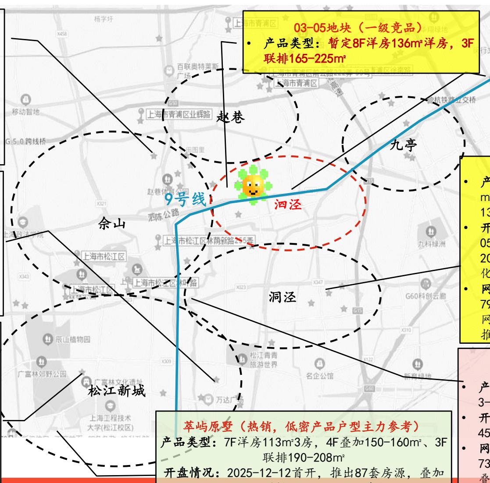

# 招商时代潮派（一级竞品）

- 产品类型：14-18F高层89-123m²3-4房，5F洋房144m²4房  
- 开盘情况：2024-6-28首开，推出234套高层，均价49701元/m²， $100\%$ 去化，入围分37.6。  
网签去化：已供应1506套，17个月去化1201套，去化率80%。高层网签流速70套/月，成交均价51327元/m²。24年月均99套，25年月均51套。洋房总套数60套，推出后基本售罄，成交均价53596元/m²

# 保利西郊和煦 (一级竞品)

- 产品类型：一期11F小高层95-120m²3-4房，联排126-165m²，二期8F洋房95-122m²3-4房，叠加135-145m²，联排132-195m²  
- 开盘情况：一期2023-10-24拿地，2024-6-26首开，2025-05认购清盘，总销售期12个月，整盘流速44套/月；二期2025-01-24拿地，2025-06-29首开191套，去化150套，去化率  $79\%$  。  
- 网签去化：二期已供应428套，5个月去化337套，去化率  $79\%$  。洋房网签流速54套/月，成交均价46662元/ $\mathrm{m}^2$ ；联排网签流速30套/月，成交均价70244元/ $\mathrm{m}^2$ ；叠加推出20套，推出即售罄，均价55239- 58506元/ $\mathrm{m}^2$

# 华发海上都荟（分流竞品）

产品类型：18F高层90-120m²3-4房、6F叠加90-122m²3-4房、4F叠加125-136m²4房  
- 开盘情况：2024-3-12首开，推出315套房源，高层45284、叠加60631，去化  $19.4\%$  
网签去化：已供应1154套，20个月去化841套，去化率 $73 \%$ 。高层网签流速36套/月，成交均价45463元/ $m ^ {2}$ 。叠加网签流速10套/月，成交均价59435元/ $m ^ {2}$

■松江新城板块项目以松江新城周边相邻街道地缘客户为主，占比达  $95\%$  ，泗泾、洞泾板块项目成交客户以松江地缘客户为主占比5-6成，上游外溢客户为辅4-5成，泗泾和洞泾板块项目客群重合度高，无论是松江地缘客户还是上游外溢客群均存在强竞争关系，但泗泾板块与上游松江新城板块项目客户重合度约10-20%，竞争分流关系较小。

<table><tr><td>板块</td><td>典型代表项目</td><td>客户成交来源</td></tr><tr><td rowspan="2">松江新城</td><td>国贸海上原墅</td><td>松江地缘客户（松江新城、松江老城为主，余山、九亭次之），占比95%，全市导入客户占比5%</td></tr><tr><td>萃屿原墅</td><td>松江本地客户占比95%，其中约74%来自项目所在的方松街道，其余主要来自上游广富林街道（7%）与下游永丰街道（7%），显示出极强的近地缘吸附力</td></tr><tr><td>泗泾（本案）</td><td>招商时代潮派</td><td>松江地缘客户从首开占比74%到续销阶段占比跌至52%（其中泗泾板块客户占比75%，松江新城客户占比25%），其他为松江外区客户，以闵行区、徐汇区占比最高。</td></tr><tr><td rowspan="2">洞泾</td><td>保利西郊和煦一期及二期</td><td>松江本区地缘客占比56%，集中于松江新城城区、洞泾、泗泾、九亭，上游闵行徐汇等轨交外溢客户占比约37%，以闵行客最多，徐汇区次之，全市外围郊区导入客7%，其中以浦东新区客户占比最高。</td></tr><tr><td>华发海上都荟</td><td>主力客户来自松江地缘客户占比6成，其中松江新城占30%，泗泾洞泾九亭占25%；闵行徐汇浦东等市区外溢客户占比3成。其中高层的外区客户比较分散，全市型的轨交置业客均有，受中介影响大，且近期外溢客量进一步减少。</td></tr></table>

热销，流速叠加>联排  

<table><tr><td>板块</td><td>项目</td><td>客积率</td><td colspan="2">产品</td><td>供应套数</td><td>成交套数</td><td>去化率</td><td>库存</td><td>成交单价</td><td>折后成交单
价</td><td>折后总价</td><td>24.1</td><td>2</td><td>3</td><td>4</td><td>5</td><td>6</td><td>7</td><td>8</td><td>9</td><td>10</td><td>11</td><td>12</td><td>25.1</td><td>2</td><td>3</td><td>4</td><td>5</td><td>6</td><td>7</td><td>8</td><td>9</td><td>10</td><td>11</td><td>12</td><td>24年月均流速</td><td>25年月均流速</td><td></td><td></td></tr><tr><td rowspan="5">湘溢</td><td rowspan="5">招商时代湘潭</td><td rowspan="5">2.3</td><td rowspan="3">14-18F高
层</td><td>89-91</td><td>392</td><td>342</td><td>87%</td><td>50</td><td>5.03</td><td>4.98</td><td>448</td><td rowspan="4" colspan="5">洋房vs小高溢价系数1.06</td><td>4</td><td>70</td><td>15</td><td>33</td><td>43</td><td>32</td><td>37</td><td>14</td><td>7</td><td>2</td><td>0</td><td>4</td><td>16</td><td>12</td><td>13</td><td>10</td><td>9</td><td>9</td><td>12</td><td>33</td><td>9</td><td></td><td></td></tr><tr><td>99-103</td><td>876</td><td>723</td><td>83%</td><td>153</td><td>5.13</td><td>5.08</td><td>513</td><td>17</td><td>123</td><td>22</td><td>12</td><td>36</td><td>52</td><td>61</td><td>30</td><td>37</td><td>68</td><td>55</td><td>34</td><td>61</td><td>30</td><td>20</td><td>12</td><td>23</td><td>12</td><td>18</td><td>46</td><td>33</td><td></td><td></td><td></td></tr><tr><td>123-127</td><td>178</td><td>144</td><td>81%</td><td>34</td><td>5.33</td><td>5.27</td><td>659</td><td>4</td><td>42</td><td>5</td><td>1</td><td>1</td><td>0</td><td>51</td><td>3</td><td>1</td><td>4</td><td>0</td><td>0</td><td>5</td><td>8</td><td>3</td><td>4</td><td>3</td><td>2</td><td>7</td><td>15</td><td>3</td><td></td><td></td><td></td></tr><tr><td>5F洋房</td><td>143</td><td>60</td><td>52</td><td>87%</td><td>8</td><td>5.36</td><td>5.36</td><td>766</td><td>——</td><td>——</td><td>——</td><td>——</td><td>11</td><td>0</td><td>21</td><td>0</td><td>17</td><td>2</td><td>1</td><td>0</td><td>0</td><td>0</td><td>0</td><td>0</td><td>0</td><td>0</td><td>0</td><td>11</td><td>7</td><td></td><td></td><td></td></tr><tr><td>汇总</td><td>1506</td><td>1261</td><td>84%</td><td>245</td><td>5.15</td><td></td><td></td><td></td><td></td><td></td><td></td><td></td><td></td><td>31</td><td>242</td><td>50</td><td>55</td><td>101</td><td>95</td><td>182</td><td>72.1</td><td>64</td><td>79</td><td>60</td><td>43</td><td>88</td><td>57</td><td>44</td><td>35</td><td>45</td><td>34</td><td></td><td>99</td><td>57</td><td></td><td></td></tr><tr><td rowspan="41">润溢</td><td rowspan="6">保利西部和敬</td><td rowspan="6">1.5</td><td rowspan="2">11F-高
层</td><td>96</td><td>360</td><td>360</td><td>100%</td><td>0</td><td>4.48</td><td>4.44</td><td>426</td><td rowspan="5" colspan="4"></td><td>14</td><td>1</td><td>12</td><td rowspan="5"></td><td rowspan="5" colspan="16">联排vs小高溢价系数1.54</td><td>9</td><td></td><td></td><td></td></tr><tr><td>119</td><td>60</td><td>60</td><td>100%</td><td>0</td><td>4.50</td><td>4.46</td><td>530</td><td>6</td><td></td><td></td><td>6</td><td></td><td></td><td></td><td></td></tr><tr><td rowspan="3">联排</td><td>126</td><td>75</td><td>75</td><td>100%</td><td>0</td><td>7.06</td><td>6.78</td><td>854</td><td>53</td><td>22</td><td></td><td>38</td><td></td><td></td><td></td><td></td><td></td></tr><tr><td>145</td><td>24</td><td>24</td><td>100%</td><td>0</td><td>6.91</td><td>6.63</td><td>962</td><td>17</td><td>7</td><td></td><td>12</td><td></td><td></td><td></td><td></td><td></td></tr><tr><td>沿河165</td><td>5</td><td>5</td><td>100%</td><td>0</td><td>7.57</td><td>7.27</td><td>1199</td><td>5</td><td></td><td></td><td>5</td><td></td><td></td><td></td><td></td><td></td></tr><tr><td>汇总</td><td>524</td><td>524</td><td>100%</td><td>0</td><td></td><td></td><td></td><td></td><td></td><td></td><td></td><td></td><td>95</td><td>30</td><td>12</td><td></td><td></td><td></td><td></td><td></td><td></td><td></td><td></td><td></td><td></td><td></td><td></td><td></td><td></td><td></td><td>46</td><td></td><td></td><td></td><td></td><td></td></tr><tr><td rowspan="35">保利西部和敬
镜墅</td><td rowspan="35">1.01</td><td rowspan="2">8F洋房</td><td>96-99</td><td>75</td><td>75</td><td>100%</td><td>0</td><td>4.4</td><td>4.22</td><td>414</td><td rowspan="7" colspan="26">叠加vs洋房溢价系数1.29，联排vs洋房溢价系数1.61</td><td></td><td></td></tr><tr><td>122</td><td>152</td><td>142</td><td>93%</td><td>10</td><td>4.54</td><td>4.36</td><td>532</td><td></td><td></td><td></td></tr><tr><td rowspan="2">4F叠加</td><td>139上</td><td>64</td><td>46</td><td>72%</td><td>18</td><td>5.66</td><td>5.43</td><td>755</td><td></td><td></td><td></td></tr><tr><td>145下</td><td>64</td><td>40</td><td>63%</td><td>24</td><td>6.08</td><td>5.84</td><td>846</td><td></td><td></td><td></td></tr><tr><td rowspan="3">联排</td><td>132</td><td>112</td><td>72</td><td>64%</td><td>40</td><td>7.29</td><td>7.00</td><td>924</td><td></td><td></td><td></td></tr><tr><td>155</td><td>9</td><td>6</td><td>57%</td><td>3</td><td>7.43</td><td>7.13</td><td>1106</td><td></td><td></td><td></td></tr><tr><td>沿河195</td><td>20</td><td>5</td><td>25%</td><td>15</td><td>7.6</td><td>7.30</td><td>1423</td><td></td><td></td><td></td><td></td></tr><tr><td>汇总</td><td>496</td><td>386</td><td>78%</td><td>110</td><td></td><td></td><td></td><td></td><td></td><td></td><td></td><td></td><td>0</td><td>2</td><td>2</td><td>0</td><td>0</td><td>0</td><td>1</td><td>9</td><td>9</td><td>25</td><td>14</td><td>6</td><td>7</td><td>4</td><td>1</td><td>0</td><td>2</td><td>3</td><td>7</td><td>4</td><td>3</td><td>2</td><td>5</td><td></td></tr><tr><td rowspan="27">华发海
上都茶</td><td>18F高层</td><td>91</td><td>175</td><td>101</td><td>58%</td><td>74</td><td>4.39</td><td>4.26</td><td rowspan="7">388</td><td rowspan="7" colspan="4"></td><td rowspan="2">46</td><td rowspan="2">23</td><td rowspan="2">19</td><td rowspan="2">30</td><td rowspan="2">28</td><td rowspan="2">33</td><td rowspan="2">19</td><td rowspan="2">37</td><td rowspan="2">24</td><td rowspan="2">68</td><td rowspan="2">45</td><td rowspan="2">20</td><td rowspan="2">49</td><td rowspan="2">47</td><td rowspan="2">35</td><td rowspan="2">32</td><td rowspan="2">20</td><td rowspan="2">21</td><td rowspan="2">30</td><td rowspan="2">14</td><td>20</td><td>56</td><td>33</td></tr><tr><td>101</td><td>970</td><td>716</td><td>74%</td><td>254</td><td>4.56</td><td>4.42</td><td>447</td><td></td><td></td><td></td></tr><tr><td>上堂90</td><td>56</td><td>19</td><td>34%</td><td>37</td><td>5.96</td><td>5.84</td><td>526</td><td>3</td><td>3</td><td></td><td></td><td></td><td></td><td>1</td><td>4</td><td></td><td></td><td>4</td><td>1</td><td></td><td></td><td></td><td></td><td></td><td></td><td></td><td></td><td></td><td></td><td></td><td></td></tr><tr><td>中堂/平
层116</td><td>50</td><td>37</td><td>74%</td><td>13</td><td>5.42</td><td>5.31</td><td>616</td><td>2</td><td>2</td><td>1</td><td>1</td><td>2</td><td>2</td><td>5</td><td>4</td><td></td><td></td><td>5</td><td>3</td><td>2</td><td>4</td><td>1</td><td>2</td><td></td><td></td><td></td><td></td><td></td><td></td><td></td><td></td></tr><tr><td>下堂122</td><td>44</td><td>24</td><td>55%</td><td>20</td><td>6.32</td><td>6.19</td><td>756</td><td>1</td><td>2</td><td>1</td><td>1</td><td>2</td><td>1</td><td>3</td><td>2</td><td>1</td><td>4</td><td>2</td><td>1</td><td>1</td><td>1</td><td></td><td></td><td></td><td></td><td></td><td></td><td></td><td></td><td></td><td></td></tr><tr><td>上堂126</td><td>40</td><td>12</td><td>30%</td><td>28</td><td>5.83</td><td>5.71</td><td>720</td><td></td><td></td><td></td><td></td><td></td><td></td><td>1</td><td></td><td></td><td></td><td>2</td><td>2</td><td>1</td><td>2</td><td></td><td></td><td></td><td></td><td></td><td></td><td></td><td></td><td></td><td></td></tr><tr><td>下堂136</td><td>40</td><td>13</td><td>33%</td><td>27</td><td>6.67</td><td>6.54</td><td>889</td><td>1</td><td>1</td><td></td><td></td><td></td><td></td><td>1</td><td>2</td><td>1</td><td></td><td></td><td>5</td><td></td><td></td><td></td><td></td><td></td><td></td><td></td><td></td><td></td><td></td><td></td><td></td></tr><tr><td>汇总</td><td>1375</td><td>922</td><td>67%</td><td>453</td><td></td><td></td><td></td><td></td><td></td><td></td><td></td><td>53</td><td>33</td><td>23</td><td>32</td><td>33</td><td>38</td><td>34</td><td>54</td><td>34</td><td>106</td><td>72</td><td>31</td><td>64</td><td>56</td><td>38</td><td>35</td><td>23</td><td>24</td><td>37</td><td>21</td><td>23</td><td></td><td></td><td></td></tr><tr><td>上堂152</td><td>37</td><td>25</td><td>68%</td><td>12</td><td>5.86</td><td>5.68</td><td>864</td><td rowspan="3" colspan="27">叠加vs洋房溢价系数预计1.19，联排vs洋房溢价系数预计1.53</td><td></td></tr><tr><td>下堂158</td><td>37</td><td>26</td><td>70%</td><td>11</td><td>5.93</td><td>5.72</td><td>904</td><td></td><td></td></tr><tr><td>上堂159</td><td>37</td><td>26</td><td>70%</td><td>11</td><td>5.93</td><td>5.72</td><td>904</td><td></td><td></td></tr><tr><td>3F联排合
院</td><td>190-208</td><td>12</td><td>4</td><td>33%</td><td>8</td><td>7.36</td><td>7.36</td><td>1408-1541</td><td></td><td></td><td></td><td></td><td></td><td></td><td></td><td></td><td></td><td></td><td></td><td></td><td></td><td></td><td></td><td></td><td></td><td></td><td></td><td></td><td></td><td></td><td></td><td></td><td></td><td></td><td></td></tr><tr><td>7F洋房</td><td>113</td><td></td><td></td><td></td><td>0</td><td></td><td>预计4.8</td><td></td><td></td><td></td><td></td><td></td><td></td><td></td><td></td><td></td><td></td><td></td><td></td><td></td><td></td><td></td><td></td><td></td><td></td><td></td><td></td><td></td><td></td><td></td><td></td><td></td><td></td><td></td><td></td></tr><tr><td>汇总</td><td>86</td><td>55</td><td>64%</td><td>31</td><td></td><td></td><td></td><td></td><td></td><td></td><td></td><td></td><td></td><td></td><td></td><td></td><td></td><td></td><td></td><td></td><td></td><td></td><td></td><td></td><td></td><td></td><td></td><td></td><td></td><td></td><td></td><td></td><td></td><td></td><td></td></tr><tr><td>8F洋房</td><td>109</td><td>243</td><td>48</td><td>20%</td><td>195</td><td>5.23</td><td>4.97</td><td rowspan="2">542</td><td rowspan="7" colspan="26">叠加vs高层溢价系数1.24，联排vs洋房溢价系数1.55</td><td></td></tr><tr><td>124</td><td>133</td><td>79</td><td>59%</td><td>54</td><td>5.33</td><td>5.06</td><td>628</td><td></td><td></td></tr><tr><td>8F叠加</td><td>上堂140</td><td>62</td><td>58</td><td>94%</td><td>4</td><td>6.18</td><td>6.14</td><td rowspan="5">860</td><td></td><td></td></tr><tr><td>下堂150</td><td>70</td><td>68</td><td>97%</td><td>2</td><td>6.48</td><td>6.44</td><td>966</td><td></td><td></td><td></td></tr><tr><td>157</td><td>104</td><td>89</td><td>86%</td><td>15</td><td>7.84</td><td>7.84</td><td>1231</td><td></td><td></td><td></td></tr><tr><td>175</td><td>34</td><td>18</td><td>53%</td><td>16</td><td>8.05</td><td>8.07</td><td>1412</td><td></td><td></td><td></td></tr><tr><td>200</td><td>24</td><td>17</td><td>71%</td><td>7</td><td>7.89</td><td>7.89</td><td>1578</td><td></td><td></td><td></td></tr><tr><td>汇总</td><td>670</td><td>377</td><td>56%</td><td>293</td><td></td><td></td><td></td><td></td><td></td><td></td><td></td><td></td><td></td><td></td><td></td><td></td><td></td><td></td><td></td><td></td><td></td><td></td><td></td><td></td><td></td><td></td><td></td><td></td><td></td><td></td><td></td><td></td><td></td><td></td><td></td></tr><tr><td>中国铁
墙+西
族云同</td><td>17F高层</td><td>125</td><td>68</td><td>20%</td><td>48</td><td>5.22</td><td>4.96</td><td rowspan="2">620</td><td rowspan="4" colspan="27">叠加vs高层溢价系数1.18</td></tr><tr><td>148</td><td>64</td><td>16</td><td>25%</td><td>48</td><td>5.59</td><td>5.31</td><td>786</td><td rowspan="2"></td><td></td><td></td></tr><tr><td>4F叠加</td><td>上堂155</td><td>14</td><td>4</td><td>29%</td><td>10</td><td>6.23</td><td>6.23</td><td rowspan="2">966</td><td></td><td></td></tr><tr><td>下堂160</td><td>14</td><td>2</td><td>14%</td><td>12</td><td>6.59</td><td>6.59</td><td>1054</td><td></td><td></td><td></td></tr><tr><td>汇总</td><td></td><td></td><td></td><td></td><td></td><td></td><td></td><td></td><td></td><td></td><td></td><td></td><td></td><td></td><td></td><td></td><td></td><td></td><td></td><td></td><td></td><td></td><td></td><td></td><td></td><td></td><td></td><td></td><td></td><td></td><td></td><td></td><td></td><td></td><td></td></tr></table>

# 2.6 未来板块竞争分析：周边竞品大库存

■ 泗泾及洞泾、余山及松江新城板块的活跃大库存量共76.43万方，大库存去化周期26.61个月；小库存量33.91万方，小库存去化周期11.67个月。整体竞争局面上，竞争项目数量较多，但流速较快，大小去化周期较为健康。

分产品业态看：

- 洋房类竞品主要为泗泾本板块的招商时代潮派，截止2025年12月，大库存3.66万方（约245套）。  
- 别墅类竞品主要来自洞泾、佘山、松江新城板块，含叠加项目8个（大库存479套），含联排项目5个（大库存245套）。

<table><tr><td>区域</td><td>板块</td><td>状态</td><td>项目(标红为含别墅)</td><td>业态</td><td>住宅总量</td><td>已供应</td><td>已售</td><td>小库存(万方)</td><td>大库存(万方)</td></tr><tr><td rowspan="22">松江</td><td rowspan="4">泗泾</td><td rowspan="2">在售</td><td>招商·时代潮派</td><td>高层/洋房</td><td>16.47</td><td>16.47</td><td>12.81</td><td>3.66</td><td>3.66</td></tr><tr><td>润和雅苑</td><td>高层</td><td>7.60</td><td>1.26</td><td>0.05</td><td>1.21</td><td>7.55</td></tr><tr><td>老盘</td><td>泗泾绿中海</td><td></td><td>13.10</td><td>5.28</td><td>2.62</td><td>2.66</td><td>10.48</td></tr><tr><td>待出让</td><td>泗泾03-05号地块</td><td>洋房/联排</td><td>2.40</td><td>0.00</td><td>0.00</td><td>0.00</td><td>2.40</td></tr><tr><td colspan="4">泗泾小计</td><td></td><td></td><td></td><td>7.53</td><td>24.09</td></tr><tr><td rowspan="7">洞泾</td><td rowspan="5">在售</td><td>保利·西郊和煦|领墅</td><td>洋房/叠加/联排</td><td>6.43</td><td>6.43</td><td>4.17</td><td>2.26</td><td>2.26</td></tr><tr><td>华发海上都荟</td><td>小高/叠加</td><td>25.60</td><td>14.50</td><td>8.83</td><td>5.67</td><td>16.77</td></tr><tr><td>香港兴业兴云间</td><td>洋房/叠加/联排</td><td>2.96</td><td>2.96</td><td>2.54</td><td>0.42</td><td>0.42</td></tr><tr><td>中建大椿·嘉利椿廷</td><td>洋房/联排</td><td>3.34</td><td>3.34</td><td>2.54</td><td>0.80</td><td>0.80</td></tr><tr><td>恒都云璟</td><td>洋房/叠加/联排</td><td>5.2</td><td>5.2</td><td>0.62</td><td>4.61</td><td>4.61</td></tr><tr><td>待售</td><td>中铁春江逸景</td><td>高层/叠加</td><td>8.00</td><td>0.00</td><td>0.00</td><td>0.00</td><td>8.00</td></tr><tr><td>待出让</td><td>洞泾镇SJS3-0001单元 0709号地块</td><td>洋房/低密</td><td>3.10</td><td>0.00</td><td>0.00</td><td>0.00</td><td>3.10</td></tr><tr><td colspan="4">洞泾小计</td><td></td><td></td><td></td><td>13.76</td><td>35.96</td></tr><tr><td rowspan="4">松江新城</td><td>在售</td><td>国贸海上原墅</td><td>洋房/叠加/联排</td><td>9.63</td><td>9.03</td><td>5.17</td><td>3.86</td><td>4.46</td></tr><tr><td>在售</td><td>中铁建西派云间</td><td>高层/叠加</td><td>9.77</td><td>1.79</td><td>0.59</td><td>1.20</td><td>9.18</td></tr><tr><td>在售</td><td>萃屿原墅</td><td>洋房/叠加/联排</td><td>3.00</td><td>0.00</td><td>0.00</td><td>0.00</td><td>3.00</td></tr><tr><td>在售</td><td>中企誉品·银湖湾</td><td></td><td>7.26</td><td>7.26</td><td>4.74</td><td>2.52</td><td>2.52</td></tr><tr><td colspan="3">松江新城小计</td><td></td><td></td><td></td><td></td><td>7.58</td><td>19.16</td></tr><tr><td rowspan="3">余山</td><td rowspan="2">在售</td><td>国贸鹭原</td><td>小高</td><td>10.86</td><td>10.86</td><td>5.70</td><td>5.16</td><td>5.16</td></tr><tr><td>国贸海峡佘山</td><td>小高/叠加</td><td>4.76</td><td>4.76</td><td>2.22</td><td>2.54</td><td>2.54</td></tr><tr><td>老盘</td><td>中凯曼茶园</td><td>独栋</td><td>3.43</td><td>3.43</td><td>2.43</td><td>1.00</td><td>1.00</td></tr><tr><td colspan="4">余山小计</td><td></td><td></td><td></td><td>8.70</td><td>8.70</td></tr><tr><td colspan="4">活跃量合计(剔除老盘、不活跃盘)</td><td></td><td></td><td></td><td></td><td>33.91</td><td>76.43</td></tr><tr><td colspan="4">去化周期</td><td></td><td></td><td></td><td></td><td>11.67</td><td>26.61</td></tr></table>

别墅明细  

<table><tr><td>大库存(套数)</td><td>叠加(套)</td><td>联排(套)</td></tr><tr><td>保利·西郊和煦|领墅</td><td>70</td><td>74</td></tr><tr><td>华发海上都荟</td><td>125</td><td>0</td></tr><tr><td>香港兴业兴云间</td><td>0</td><td>21</td></tr><tr><td>中建大椿·嘉利椿廷</td><td>0</td><td>1</td></tr><tr><td>恒都云璟</td><td>24</td><td>88</td></tr><tr><td>中铁春江逸景</td><td>24</td><td>0</td></tr><tr><td>国贸海上原墅</td><td>14</td><td>45</td></tr><tr><td>中铁建西派云间</td><td>68</td><td>0</td></tr><tr><td>萃屿原墅</td><td>150</td><td>16</td></tr><tr><td>国贸海峡佘山</td><td>12</td><td>0</td></tr><tr><td>汇总</td><td>487</td><td>245</td></tr></table>

2.7竞品分析：周边典型竞品案例  

<table><tr><td>项目名称</td><td>招商时代潮派(泗泾)</td><td>保利西郊和煦一期(洞泾)</td><td>保利西郊和煦二期领墅(洞泾)</td><td>华发海上都荟(洞泾)</td></tr><tr><td>项目定位</td><td>轨交TOD刚需大盘</td><td colspan="2">G60科创封面的浓阴墅区</td><td>双轨交刚需、刚改大盘</td></tr><tr><td>开发商</td><td></td><td></td><td></td><td></td></tr><tr><td>拿地时间</td><td>2024/01/10</td><td>2023/10/24</td><td>2025/01/24</td><td>2023/7/11</td></tr><tr><td>首开时间</td><td>2024/06/28</td><td>2024/06/26</td><td>2025/06/29</td><td>2024/4/30</td></tr><tr><td>楼面价</td><td>17634元/㎡</td><td>24638元/㎡</td><td>29,425元/㎡</td><td>25850元/㎡</td></tr><tr><td>建筑面积</td><td>16.4万㎡</td><td>9.9万方</td><td>13.0万㎡</td><td>27.3万㎡</td></tr><tr><td>容积率</td><td>2.3</td><td>1.5</td><td>1.01</td><td>2.1</td></tr><tr><td>物业类型</td><td>高层、洋房</td><td>11F小高、联排</td><td>8F洋房、4F叠加、联排</td><td>高层18F,叠加4F、6F</td></tr><tr><td>主力户型</td><td>高层89-140㎡</td><td>小高95-120㎡
联排126-165㎡</td><td>洋房95-122㎡
叠加135-145㎡
联排132-195㎡</td><td>高层90-120㎡
6F叠加90-122㎡
4F叠加125-136㎡</td></tr><tr><td>总户数</td><td>1975套</td><td>524套</td><td>496套</td><td>956套(一期地块可售)</td></tr><tr><td>成交均价</td><td>联动价51100</td><td>小高44700,联排70000</td><td>洋房45000,叠加58000,联排73000</td><td>高层45000,叠加59000</td></tr><tr><td>精装成本</td><td>精装2500</td><td>高层2500,联排毛坯</td><td>洋房2500,叠加3000,联排毛坯</td><td>高层精装2500</td></tr></table>

# 2.7 一级竞品：招商时代潮派 —TOD综合体大盘项目，仅首开和二开时100%去化，之后开盘去化率快速下滑

■项目位于泗泾板块核心-泗泾地铁站北，由2幅住宅建面16.4万方和1幅商业组成，住宅部分共规划约1900套，定位为轨交TOD大盘。项目2024/01/10拿地，2024/06/28首开。  
从历次加推情况看，仅首开和二开时100%去化，之后开盘去化率下滑，最近6/29加推238套仅去化20套，去化率8%，12月接退108套仅去化9套。

  
招商时代潮派总图

招商时代潮派历次开盘去化情况  

<table><tr><td>本次开盘时间</td><td>开盘批次</td><td>本批物业类型</td><td>本期供应套数</td><td>当天去化套数</td><td>当天去化率</td><td>本期单价</td></tr><tr><td>2024年6月28日</td><td>首开</td><td>小高层</td><td>234</td><td>234</td><td>100%</td><td>49701</td></tr><tr><td>2024年7月28日</td><td>加推</td><td>小高层、洋房</td><td>123</td><td>123</td><td>100%</td><td>49500</td></tr><tr><td>2024年9月15日</td><td>加推</td><td>小高层</td><td>102</td><td>45</td><td>44%</td><td>49803</td></tr><tr><td>2024年10月1日</td><td>加推</td><td>小高层</td><td>146</td><td>31</td><td>21%</td><td>51075</td></tr><tr><td>2024年11月15日</td><td>加推</td><td>高层</td><td>136</td><td>38</td><td>28%</td><td>51664</td></tr><tr><td>2024年12月25日</td><td>加推</td><td>小高层、洋房</td><td>160</td><td>90</td><td>56%</td><td>53168</td></tr><tr><td>2025年2月16日</td><td>加推</td><td>小高层、洋房</td><td>153</td><td>50</td><td>33%</td><td>52377</td></tr><tr><td>2025年3月30日</td><td>加推</td><td>小高层</td><td>81</td><td>24</td><td>30%</td><td>51086</td></tr><tr><td>2025年5月20日</td><td>加推</td><td>小高层</td><td>133</td><td>15</td><td>11%</td><td>50756</td></tr><tr><td>2025年6月29日</td><td>加推</td><td>小高层</td><td>238</td><td>20</td><td>8%</td><td>52743</td></tr><tr><td>2025年12月24日</td><td>加推</td><td>中高层</td><td>108</td><td>9</td><td>平推</td><td>50105</td></tr></table>

# 2.7 一级竞品：招商时代潮派一月均流速24年99套，25年47套，下行明显，源于全市市场下行，板块客户快速减少，而洋房实现溢价及热销，源于套数少（60套），销售期24.10月-25.2月为上海旺季。

> 销售至今，成交均价51488元/平，平均签约流速66套/月，24年月均99套，25年月均47套。  
> 流速一方面跟随上海全市市场周期下行，另一方面地缘及上游外溢刚需客户均快速消耗减少，除泗泾外，当前五大新城轨交板块普遍面临市区刚需外溢客减少的情况，目前项目销售折扣不断加码，现阶段渠道佣金7-8万/套，折扣95折，8-10万车位优惠券+6-8万荟豆  
> 洋房实现热销，一方面源于套数少（60套），仅占全盘套数4%，另一方面销售期24年10月-25年2月为上海旺季，其定价也因为量少稀缺，对比高层溢价5%

招商时代潮派分户型价格、去化情况  

<table><tr><td>业态</td><td>户型面积</td><td>功能</td><td>已供套数</td><td>签约套数</td><td>已供去化率</td><td>单价</td><td>套总价</td><td>近一年
月均流速</td></tr><tr><td rowspan="3">高层</td><td>89-91</td><td>3房1卫</td><td>392</td><td>342</td><td>87%</td><td>5.0</td><td>451</td><td rowspan="4">47套/月</td></tr><tr><td>99-103</td><td>3房2卫</td><td>876</td><td>723</td><td>83%</td><td>5.1</td><td>511</td></tr><tr><td>123-127</td><td>3+1房2卫</td><td>178</td><td>144</td><td>81%</td><td>5.3</td><td>660</td></tr><tr><td>洋房</td><td>143</td><td>4房2卫</td><td>60</td><td>52</td><td>87%</td><td>5.4</td><td>756</td></tr><tr><td colspan="3">合计</td><td>1614</td><td>1261</td><td>84%</td><td>5.1</td><td></td><td></td></tr></table>

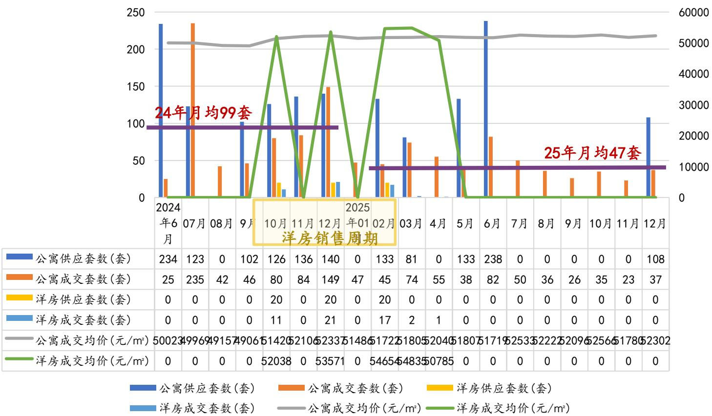  
招商时代潮派开盘以来月度销售情况

# 2.7 一级竞品：招商时代潮派一户型整体偏刚，500万内轨交刚需为主

■ 住宅东、西两块分为一、二期，17栋18F高层和3栋6F洋房；两期定位相同，但一期为老规范8平阳台，二期为新规，做了2-3个阳台，实用率提升。  
产品整体偏刚，90-100平的三房占比85%，主力总价450-510万，主要吸引轨交刚需客户；99m²3房2卫功能型产品相较101-103m²去化更好；  
■ 刚改产品为123/127平3+1房2卫，总价约650万，以及改善型洋房143平4房2卫（750万），去化率均较好，泗泾的功能和面积改善需求较为充足。

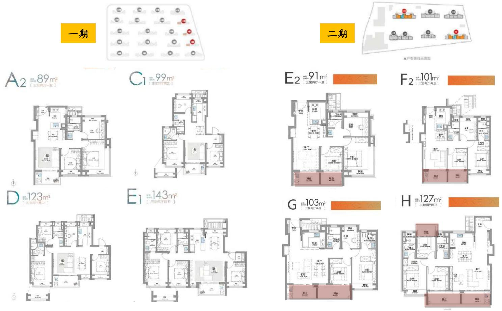

# 2.7 一级竞品：保利西郊和煦（一期）&领墅（二期），板块标杆热销盘，二期对比一期去化热度及流速均有放缓，叠加精装新规产品板块首发，流速最快，实现热销

■项目位于松江洞泾低密墅区，周边轨交12号线延长线在建，近G60科创中心；一期2023/10/24拿地，2024/6/26首开，2025/05认购清盘，总销售期12个月，整盘流速44套/月；二期2025/01/24拿地，2025/06/29首开191套，去化150套，去化率79%，8-10月分别加推3次，去化率50-57%，最近一次加推在11月29日，平推68套，去化8套。二期（洋房32套/月，叠加开盘22套/月，联排12套/月）对比一期（一期整盘流速：小高35套/月，联排19套/月）洋房、联排流速有所放缓，但叠加产品市场首发，流速最快实现热销。

# 现阶段渠道返客户6-8万，享3%折扣优惠

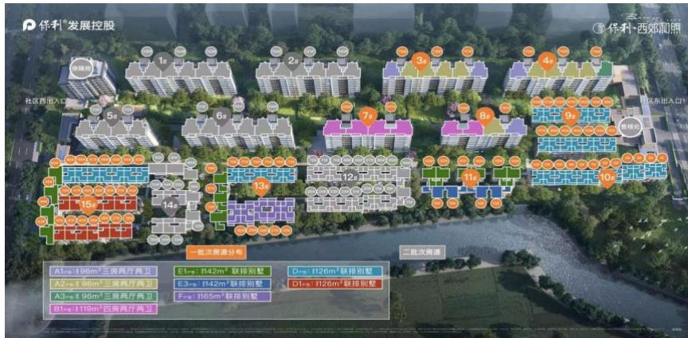  
一期

<table><tr><td>业态</td><td>户型</td><td>总套数(套)</td><td>套数比例</td><td>成交均价(万
元/㎡)</td><td>总价段（万）</td></tr><tr><td rowspan="2">小高</td><td>96</td><td>360</td><td>69%</td><td>4.48</td><td>430</td></tr><tr><td>119</td><td>57</td><td>11%</td><td>4.50</td><td>540</td></tr><tr><td rowspan="3">联排</td><td>126</td><td>75</td><td>14%</td><td>7.06</td><td>900</td></tr><tr><td>145</td><td>24</td><td>5%</td><td>6.91</td><td>1020</td></tr><tr><td>沿河165</td><td>5</td><td>1%</td><td>7.57</td><td>1220</td></tr><tr><td></td><td>合计</td><td>524</td><td>100%</td><td>5.30</td><td></td></tr></table>

  
二期领墅

<table><tr><td>业态</td><td>户型</td><td>总套数(套)</td><td>套数比例</td><td>成交均价 (元/㎡)</td><td>总价段(万)</td></tr><tr><td rowspan="2">洋房</td><td>96</td><td>75</td><td>15%</td><td>4.40</td><td>430</td></tr><tr><td>122</td><td>152</td><td>31%</td><td>4.54</td><td>555</td></tr><tr><td rowspan="2">叠加</td><td>139上</td><td>64</td><td>13%</td><td>5.66</td><td>790</td></tr><tr><td>145下</td><td>64</td><td>13%</td><td>6.08</td><td>880</td></tr><tr><td rowspan="3">联排</td><td>132</td><td>112</td><td>23%</td><td>7.29</td><td>966</td></tr><tr><td>155</td><td>9</td><td>2%</td><td>7.43</td><td>1120</td></tr><tr><td>沿河195</td><td>20</td><td>4%</td><td>7.60</td><td>1480</td></tr><tr><td></td><td>合计</td><td>496</td><td></td><td></td><td></td></tr></table>

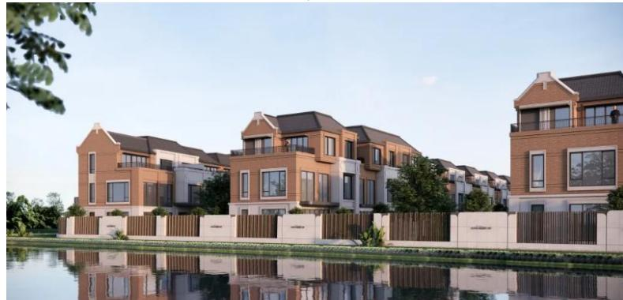  
联排立面

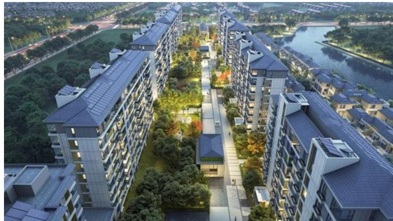  
洋房立面

# 2.7 一级竞品：保利西郊和煦（一期）&领墅（二期），二期新增精装叠加产品去化表现优异，上叠流速快于下叠

■ 一期产品为小高+联排，联排主力126/145平，采取强控面积、提升单价、控制总价的策略，总价900/1000万，实现单价跃升至7.0万，联排开盘即清。（比较23年泗泾花语天境159平，同总价1000万，单价6.1万），小高单价4.5万，一期整盘流速：小高35套/月，联排19套/月。  
■二期延续一期产品策略，联排主力132平，单价7.3万，总价966万；沿河资源联排从165平扩大至195平，总价上探至1500万，靠强资源支撑。二期增加叠加139/145平，均价5.86万，主要目的：1）大幅降低整盘洋房占比（一期  $80\%$  ，二期  $46\%$  ）；2）一期+二期共1000户，增加别墅类型的丰富性。二期洋房成交均价4.5万。二期整盘流速：洋房32套/月，叠加22套/月，联排12套/月，新增精装叠加产品去化表现优异，上叠流速快于下叠。

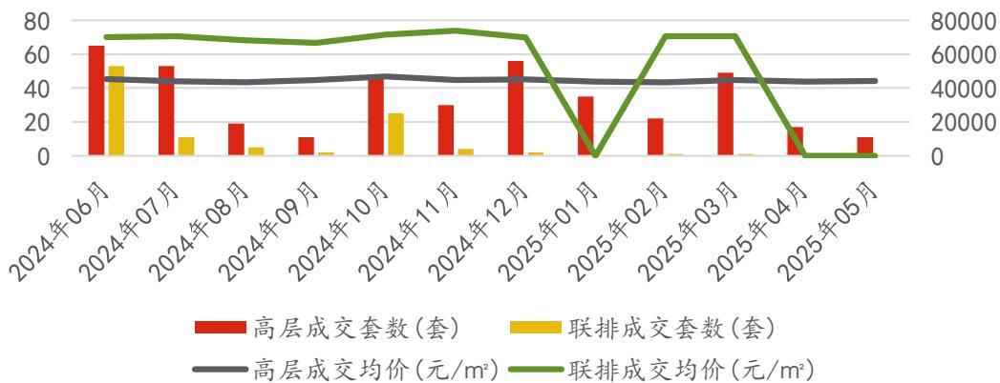  
保利西郊和煦（一期）月度销售走势

<table><tr><td>业态</td><td>户型</td><td>成交综合均价(万元/m2)</td></tr><tr><td rowspan="2">小高</td><td>96</td><td rowspan="2">4.48</td></tr><tr><td>119</td></tr><tr><td rowspan="3">联排</td><td>126</td><td rowspan="3">7.05</td></tr><tr><td>145</td></tr><tr><td>沿河165</td></tr></table>

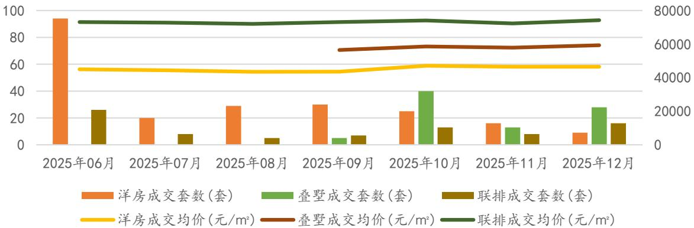  
保利西郊和煦领墅（二期）月度销售走势

<table><tr><td>业态</td><td>户型</td><td>总套数
(套)</td><td>供应套数</td><td>成交套数</td><td>去化率</td><td>成交均价
(元/㎡)</td><td>成交综合
均价(万
元/㎡)</td><td>成交总价
(万)</td></tr><tr><td rowspan="2">洋房</td><td>96</td><td>75</td><td>75</td><td>75</td><td>100%</td><td>4.40</td><td rowspan="2">4.50</td><td>430</td></tr><tr><td>122</td><td>152</td><td>152</td><td>142</td><td>93%</td><td>4.54</td><td>555</td></tr><tr><td rowspan="2">叠加</td><td>139上</td><td>64</td><td>64</td><td>46</td><td>72%</td><td>5.66</td><td rowspan="2">5.86</td><td>790</td></tr><tr><td>145下</td><td>64</td><td>64</td><td>40</td><td>63%</td><td>6.08</td><td>880</td></tr><tr><td rowspan="3">联排</td><td>132</td><td>112</td><td>112</td><td>72</td><td>64%</td><td>7.29</td><td rowspan="3">7.33</td><td>966</td></tr><tr><td>155</td><td>9</td><td>9</td><td>6</td><td>67%</td><td>7.43</td><td>1120</td></tr><tr><td>沿河195</td><td>20</td><td>20</td><td>5</td><td>25%</td><td>7.60</td><td>1480</td></tr><tr><td></td><td>合计</td><td>496</td><td>496</td><td>386</td><td>78%</td><td>——</td><td>——</td><td>——</td></tr></table>

# 2.7 一级竞品：保利西郊和煦领墅一户型面积控制小、功能强、赠送面积多

■ 小高层赠送全飘窗、电梯前厅，得房率77-80%：96m²3房2厅2卫，所有房间+厨房共赠送“3个飘窗+1个270°采光窗面”；122m²4房2卫，除了全飘窗外，还赠送了私享电梯前厅，做到玄关外置。  
叠加整体做到了三面宽，下叠赠送二层挑空、地下室、花园，上叠赠送露台，整体得房率130-150%。  
联排赠送挑空客餐厅和通高内天井，附赠地下室、花园、L型南露台等，整体得房率200%以上。

96m³3房2卫 1T2户

  
122m²4房2卫 1T2户

$139\mathrm{m}^2$  上叠

  
三层

  
四层

$145\mathrm{m}^2$  下叠

  
E一层 一层

  
二层

$132\mathrm{m}^2$  联排

  
部分投资者申请赎回（包括平仓、变现解禁，将下述市场规则的最新版本更新至2023年1月19日。

  
超享独立附加立体场域

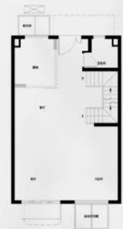  
目前香港经济中心位置十分开阔，如新加坡、新加坡城市内商业金融中心等城市都能看见。如果您对香港

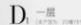  
墅藏前庭后院，LDK无界宽厅赛场  
中空独立挑高，营设世家待客礼序

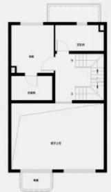  
窖藏佳酿or茗香酥明  
沉浸式打造百变私人志趣空间  
D二层（2015·四川卷）

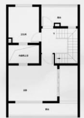  
预留X多功能间，咫尺花园，时刻感知自然景致  
过程稿仅供参考  
D三层

$195 \mathrm{~m}^{2}$  联排

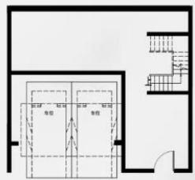  
据《国家大事风云录》/关心事件、事件记载：旗下两家券商向券商举报及发布澄清声明，引发市场各方关注。

  
灵动地下私享领地  
沉浸打造独立附加场域

  
（2）按需要来决定的尺寸长度、半径或截面，应有制作用的简单易切削和磨削多，但应防止加工负重。

  
一步尊享，南向双开门入户礼制  
超大采光面宽，巨幕全景视界

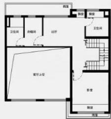  
以品位诠释空间的互动性  
C二层（1）甲醇（2）乙醇

  
LDK一体化无界宽厅，南北双享景观入户  
过程稿仅供参考  
C.三层

# 2.7 一级竞品：保利西郊和煦 —成交客户结构

■ 成交客户工作区域结构：松江本区地缘客占比5成，集中于松江新城城区、洞泾、泗泾、九亭；上游闵行徐汇等轨交外溢客户占比约4成，以闵行客最多。  
■ 年龄及家庭结构：以30-45中青年为主，占比80%；家庭结构以三口之家为主，占比38%，其次为二胎家庭24%；  
■ 置业目的：主要为改善自住，面积与功能改善，占比65%。

  
成交客户工作区域结构

  
联排成交客户特征

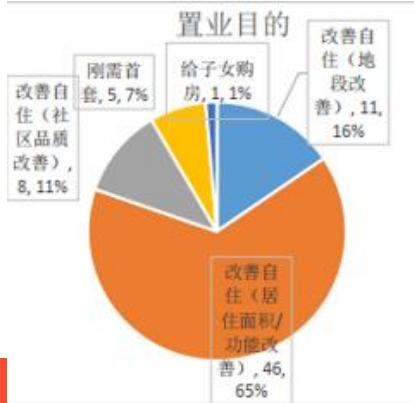

# 2.7分流竞品：华发海上都荟—双地铁轨交大盘项目，产品定位刚需，依赖拉高毛坯低密度产品定价，做低高层售价保障项目全盘流速，低密产品整体去化不佳

■位于洞泾板块，距离9号线、12号线交汇处洞泾站400米，典型轨交大盘。项目于2023年7月11日土拍（共计3块地），容积率2.1，计容面积万27.3万方，总住宅约2700套。配置下沉式会所、室内泳池及健身房。24年3月开售楼处，4月首开，至今销售20个月，整盘流速42套/月，近一年整盘流速40套/月，现阶段全盘95折扣+返现（部分叠拼70万）+渠道链家13万/套+3万车位券+免1年物业费+1.5万家电  
整盘定位刚需刚改，户型面积较小，产品为高层91-101平三房，6F叠加90/116/122平，4F叠加124/136平。高层均价4.54万元/平，叠加均价5.94万元/平；分产品去化速度看，高层101平（主流刚需）>叠加中层、平层116平>122平（小刚改）>高层91平>叠加90/126-136平，双轨交刚需三房销售最佳，其次为500-770万的小叠加，而750-900万的叠加则表现不佳。

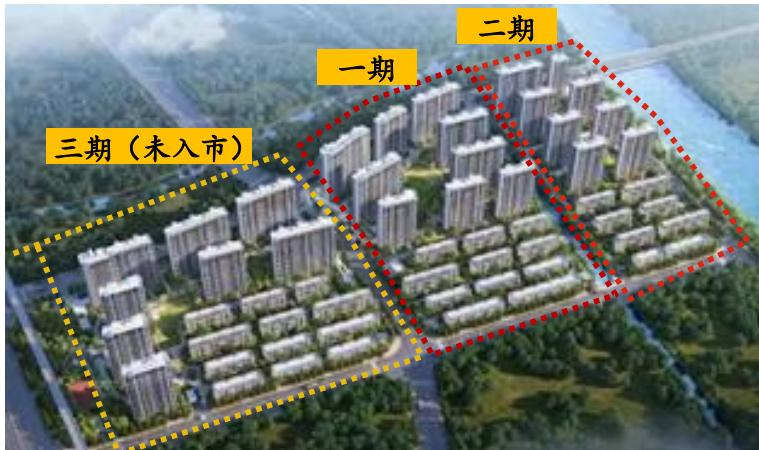

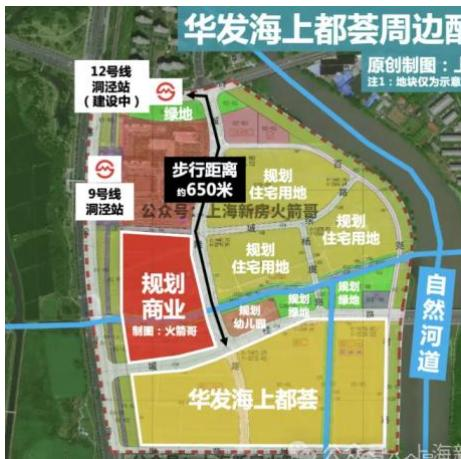

<table><tr><td>业态</td><td>面积</td><td>单价(万/平)</td><td>总阶段(万)</td><td>已供套数</td><td>已售套数</td><td>去化率</td></tr><tr><td rowspan="2">高层</td><td>91</td><td>4.39</td><td>400</td><td>175</td><td>101</td><td>58%</td></tr><tr><td>101</td><td>4.56</td><td>460</td><td>970</td><td>716</td><td>74%</td></tr><tr><td rowspan="3">6F叠加</td><td>上叠90</td><td>5.96</td><td>536</td><td>56</td><td>19</td><td>34%</td></tr><tr><td>中叠/平层116</td><td>5.42</td><td>629</td><td>50</td><td>37</td><td>74%</td></tr><tr><td>下叠122</td><td>6.32</td><td>771</td><td>44</td><td>24</td><td>55%</td></tr><tr><td rowspan="2">4F叠加</td><td>上叠126</td><td>5.83</td><td>735</td><td>40</td><td>12</td><td>30%</td></tr><tr><td>下叠136</td><td>6.67</td><td>907</td><td>40</td><td>13</td><td>33%</td></tr><tr><td>合计</td><td></td><td>4.74</td><td>——</td><td>1375</td><td>922</td><td>67%</td></tr></table>

  
华发海上都荟月度销售走势

# 2.7分流竞品：华发海上都荟一户型面积小、控总价

4房功能、总价、附赠是叠加最关注的点，630万中叠销售最佳，兼顾4房功能和性价比。高层是90-100平的纯刚需产品。

去化最快的是中叠116平，4房3卫功能，赠送南北露台和独立电梯厅，单价5.4万总价630万，满足4房功能且性价比极高，已供去化率75%。  
其次是下叠122平，4房3卫功能，赠送地下室花园，单价6.3万总价770万，已供去化率  $60\%$  
■再次为上叠90平，仅3房2卫功能，赠送南北露台、但无阁楼，单价6万总价530万，但同样三房功能的高层仅需460万，已供去化率41%。  
4F叠加126-132平去化最慢，总价750-900万过高，已供去化率仅  $33\%$

E 913室两厅两卫

阅G户型|101of三室两厅两卫

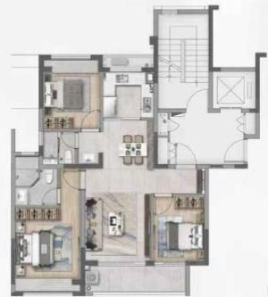

粤韵二国韵 原声韵动

华 熊E户型|90m²|三堂两厅两卫

  
五层

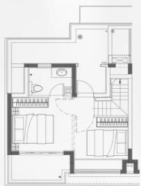  
上叠南北露台  
六层

粤阅阅阅阅阅阅阅阅阅阅阅阅阅阅阅阅阅阅阅阅阅阅阅阅阅阅阅阅阅阅阅阅阅阅阅阅阅阅阅阅阅阅阅阅阅阅阅阅阅阅阅阅阅阅阅阅阅阅阅阅阅阅阅阅阅阅阅阅阅阅阅阅阅阅阅阅阅阅阅阅阅阅阅阅阅阅阅阅阅阅阅阅阅阅阅阅阅阅阅阅

华 D户型 116m³ 三室两厅三卫

  
三层

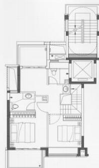  
中叠南北露台  
四层

四二维

华C户型122m四室两厅三卫

  
下叠地下室、花园  
地下一层

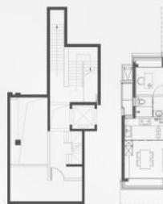  
地下夹层  
一层

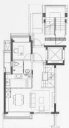

  
二层

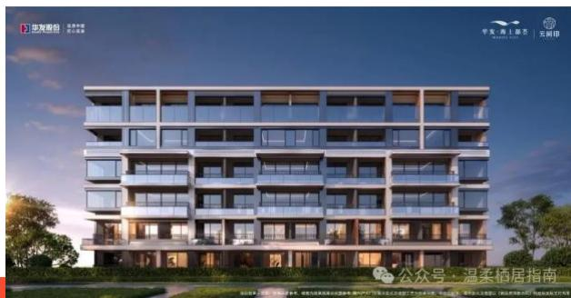

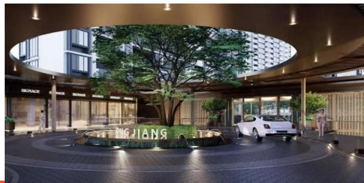

# 2.7分流竞品：华发海上都荟一成交客户结构

# 主力客户来自松江地缘6成，闵行徐汇浦东等市区外溢3成，且近期外溢刚需客户呈减少趋势

松江地缘客占6成，其中松江新城占  $30\%$  ，泗泾洞泾九亭占  $25\%$  ，为主要客群来源；  
■次主力为闵行徐汇浦东等市区外溢客，叠加占  $31\%$  。高层的外区客户比较分散，全市型的轨交置业客均有，受中介影响大。  
■ 与案场交流，近期外溢客量进一步减少，尤其是外溢刚需客户量下降明显，“刚需韭菜越来越难割了”。

  
高层认购客户居住区域分析

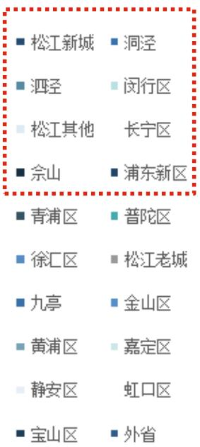  
松江63%+闵行等市区21%

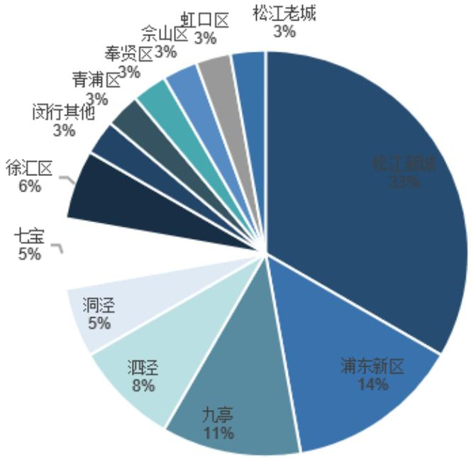  
叠拼认购客户居住区域分析

  
松江60%+闵行浦东等市区31%

# 2.7 待售竞品：泗泾03-05代建地块

泗泾03-05地块产品为8F洋房+联排，洋房主力面积段为  $136\mathrm{m}^2$  ，联排  $165 - 225\mathrm{m}^2$  ，与本案形成错位竞争。

<table><tr><td>套型面积</td><td>户数</td><td>户数比</td><td>面积</td><td>面积比</td></tr><tr><td>110</td><td>8</td><td>4.64%</td><td>759.5</td><td>3.29%</td></tr><tr><td>136</td><td>80</td><td>52.98%</td><td>10880</td><td>47.14%</td></tr><tr><td>148</td><td>7</td><td>4.64%</td><td>1037.22</td><td>4.49%</td></tr><tr><td>165.5</td><td>19</td><td>12.58%</td><td>3214</td><td>13.93%</td></tr><tr><td>175.5</td><td>20</td><td>13.25%</td><td>3510</td><td>15.21%</td></tr><tr><td>200</td><td>17</td><td>11.26%</td><td>3451</td><td>14.95%</td></tr><tr><td>225</td><td>1</td><td>0.66%</td><td>227</td><td>0.98%</td></tr><tr><td>合计</td><td>152</td><td>100.00%</td><td>23078.72</td><td>100.00%</td></tr></table>

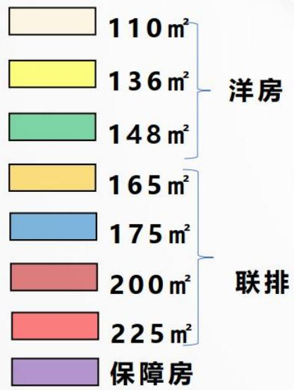

# 2.7 待售竞品：泗泾03-05代建地块 洋房户型

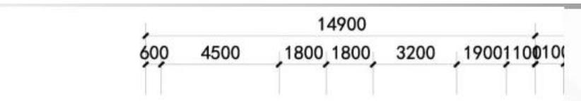

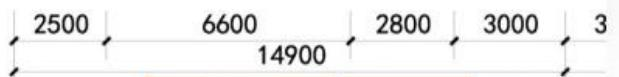

<table><tr><td>户型面积</td><td>148</td></tr><tr><td>阳台赠送</td><td>13.6</td></tr><tr><td>花池赠送</td><td>3.9</td></tr><tr><td>设备赠送</td><td>2.3</td></tr><tr><td>飘窗赠送</td><td>14.4</td></tr></table>

<table><tr><td>户型面积</td><td>136</td></tr><tr><td>阳台赠送</td><td>12.5</td></tr><tr><td>花池赠送</td><td>3.8</td></tr><tr><td>设备赠送</td><td>2.3</td></tr><tr><td>飘窗赠送</td><td>8.2</td></tr></table>

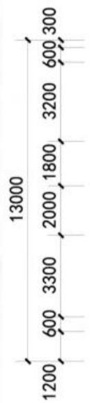

<table><tr><td>户型面积</td><td>115.5</td></tr><tr><td>阳台赠送</td><td>10.8</td></tr><tr><td>花池赠送</td><td>1.9</td></tr><tr><td>设备赠送</td><td>1.7</td></tr><tr><td>飘窗赠送</td><td>4.9</td></tr></table>

# 2.7 待售竞品：泗泾03-05代建地块联排户型

  
本项目联排户型165

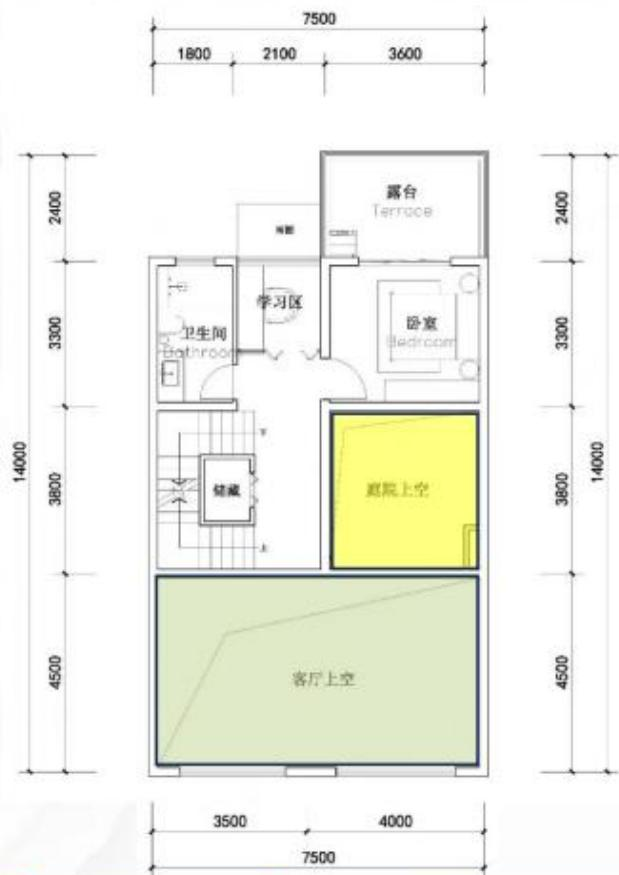  
本项目联排户型175

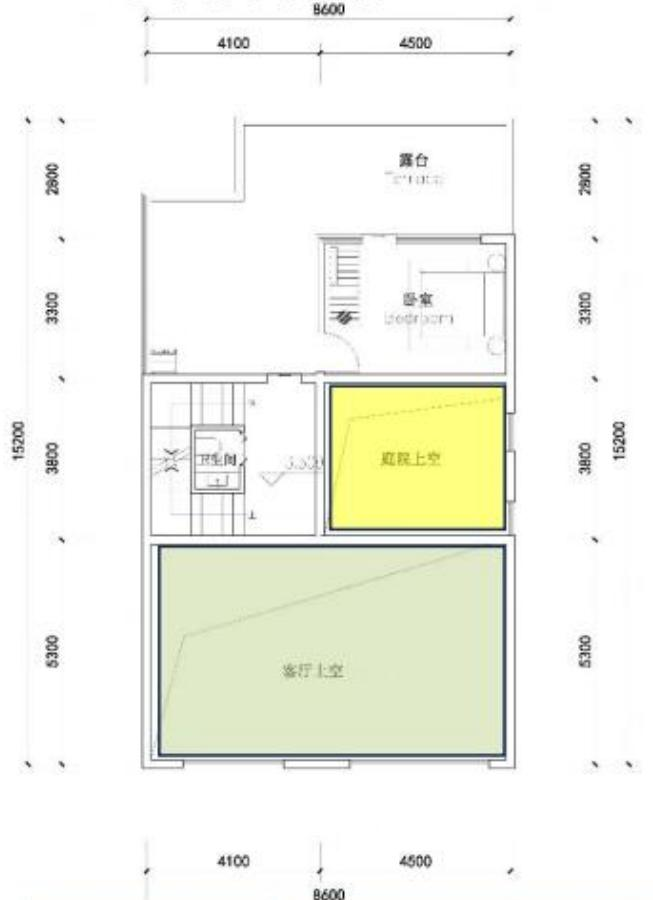  
本项目联排户型200

<table><tr><td>户型面积</td><td colspan="2">165</td></tr><tr><td>客厅挑空</td><td>29.93</td><td rowspan="2">25.67%</td></tr><tr><td>天井挑空</td><td>12.24</td></tr></table>

<table><tr><td>户型面积</td><td colspan="2">175</td></tr><tr><td>客厅挑空</td><td>32.12</td><td rowspan="2">25.24%</td></tr><tr><td>天井挑空</td><td>12.24</td></tr></table>

<table><tr><td>户型面积</td><td colspan="2">200</td></tr><tr><td>客厅挑空</td><td>42.8</td><td rowspan="2">28.7%</td></tr><tr><td>天井挑空</td><td>15.48</td></tr></table>

# 2.7 待售竞品：泗泾03-05代建地块 立面意向图

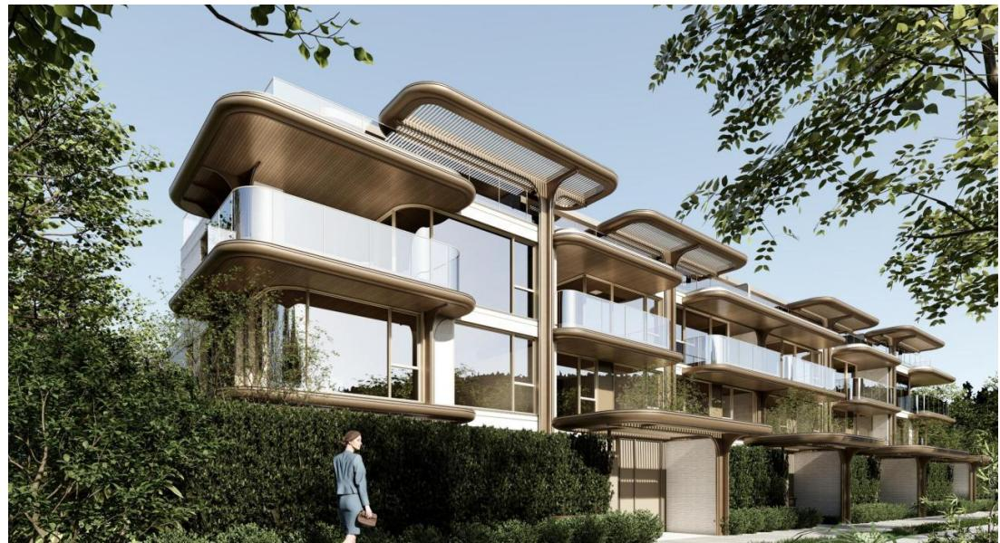

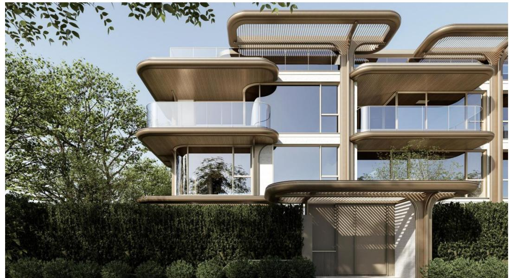

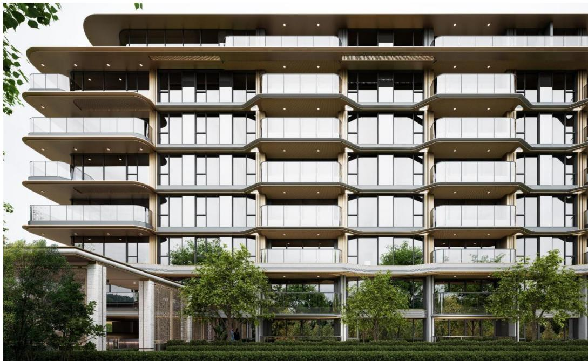

# 2.8 二手房竞争分析：泗泾板块转向“二手房主导”市场，公寓类产品是交易核心，别墅类产品有限；二手房呈现“量稳价跌”特征，对公寓类新房形成的分流最为显著。

■ 泗泾板块市场从“新房主导”转向“二手房主导”，2025年“二手/新房”成交比值突破1.8；  
■二手房市场中，公寓类产品是交易核心，成交量稳步增长，对新房市场形成分流；别墅类规模有限且增长平缓。  
■2015年后竣工的次新二手房呈现“量稳价跌”特征，对新房市场形成进一步的价格优势。

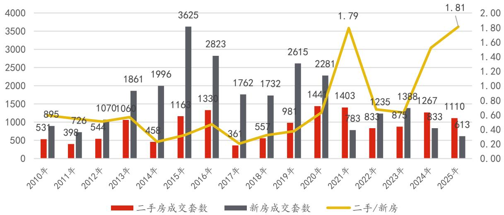  
泗泾板块二手房、新房成交套数

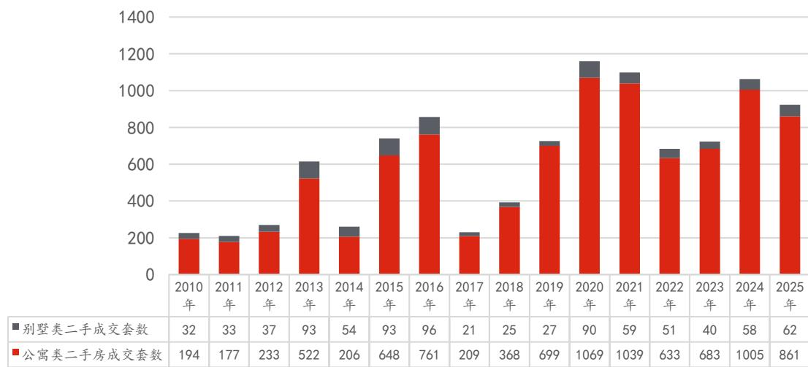  
泗泾板块公寓类、别墅类二手房成交套数

  
泗泾板块近6年次新二手成交量价走势（2015年后竣工）

泗泾板块15年后竣工次新房

25年vs24年二手成交均价同比：下跌  $5\%$

二手成交价格下跌趋势明显

# 2.8二手房竞争分析：公寓次新房典型代表项目多盘破发，近三年二手成交价格降幅达  $30 - 40\%$  ，对新房市场影响较大

■周边公寓次新房项目较多，近三年成交价格跌幅在30-40%之间，成交单价在4--5万之间，对新房分流影响不断加剧。

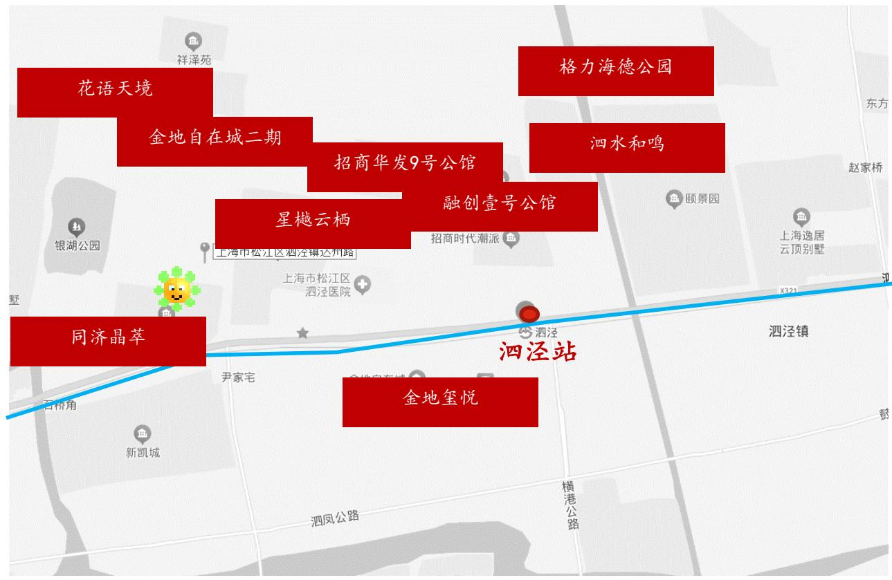

<table><tr><td colspan="3">项目/分类</td><td>交付年份</td><td>开盘年份 /新房开 盘售价</td><td>25年成 交套数</td><td>22年成 交均价 (万/m²)</td><td>25年成 交均价 (万/m²)</td><td>相对开 盘价格 涨幅</td><td>相对 2022年 价格跌幅</td><td>25年套 均总价 (万)</td><td>25年成 交套均 面积</td></tr><tr><td rowspan="9">泗泾</td><td rowspan="9">5-15 年次 新房</td><td>中铁建金 地花语天 境</td><td>2023- 2024</td><td>2022 4.86</td><td>14</td><td>——</td><td>4.50</td><td>-7%</td><td>——</td><td>428</td><td>95</td></tr><tr><td>招商华发 9号公馆</td><td>2021- 2022</td><td>2020 4.58</td><td>11</td><td>——</td><td>4.59</td><td>0.2%</td><td>——</td><td>440- 540</td><td>98-115</td></tr><tr><td>格力·公 园海德</td><td>2023</td><td>2022 5.48</td><td>1</td><td>——</td><td>4.52</td><td>-18%</td><td>——</td><td>540</td><td>121</td></tr><tr><td>泗水和鸣</td><td>2022</td><td>2020 4.62</td><td>2</td><td>——</td><td>5.17</td><td>12%</td><td>——</td><td>430- 600</td><td>86-129</td></tr><tr><td>同济晶萃</td><td>2019- 2023</td><td>2020 4.45</td><td>——</td><td>7.25</td><td>4.67</td><td>5%</td><td>-36%</td><td>380-460</td><td>90-110</td></tr><tr><td>金地玺悦</td><td>2020</td><td>2019 4.06</td><td>9</td><td>6.67</td><td>5.0</td><td>23%</td><td>-25%</td><td>470-650</td><td>94-134</td></tr><tr><td>融创壹号 公馆</td><td>2019- 2020</td><td>2019 4.8</td><td>30</td><td>7.29</td><td>4.51</td><td>-6%</td><td>-38%</td><td>380-430</td><td>86-94</td></tr><tr><td>金地自在 城二期</td><td>2014- 2018</td><td>2014 2.05</td><td>6</td><td>5.33</td><td>3.37</td><td>64%</td><td>-37%</td><td>290-500</td><td>87-148</td></tr><tr><td>星樾云栖</td><td>2023- 2024</td><td>2022 4.81</td><td>2</td><td>——</td><td>4.68</td><td>-3%</td><td>——</td><td>470</td><td>100</td></tr></table>

# 2.8 二手房竞争分析：板块及邻近片区内二手别墅

■ 板块内二手房别墅成交总价多在700-1100万区间，与新房成交总价趋同，存在分流竞争关系。

<table><tr><td colspan="3">项目/分类</td><td>交付年份</td><td>业态</td><td>25年成
交套数</td><td>25年成
交均价
(万/m²)</td><td>25年套均总
价(段)</td><td>25年成交
套均面积</td></tr><tr><td rowspan="5">泗泾</td><td rowspan="5">5-15年次新房</td><td>中铁建金地花语天境</td><td>2023-2024</td><td>联排</td><td>2</td><td>5.38</td><td>850</td><td>160</td></tr><tr><td>金地西郊风华</td><td>2022</td><td>联排</td><td>3</td><td>6.80</td><td>1145</td><td>232</td></tr><tr><td>同济晶萃</td><td>2019-2023</td><td>叠加</td><td>5</td><td>5.30</td><td>711</td><td>117</td></tr><tr><td>上坤樾山·明月</td><td>2015-2019</td><td>联排</td><td>待会合
适</td><td>5.81</td><td>773</td><td>171</td></tr><tr><td>泗泾颐景园</td><td>1998-2013</td><td>联排</td><td>3</td><td>4.46</td><td>925</td><td>277-323</td></tr><tr><td rowspan="4">赵巷</td><td rowspan="4">5-15年次新房</td><td>花语江南</td><td>2022-2024</td><td>叠加</td><td>3</td><td>5.6</td><td>920</td><td>160</td></tr><tr><td>万科有山</td><td>2016-2017</td><td>叠加</td><td>30</td><td>5.1</td><td>574</td><td>114-148</td></tr><tr><td>保利建工西郊锦庐</td><td>2016-2019</td><td>叠加</td><td>33</td><td>4.9</td><td>582</td><td>114-166</td></tr><tr><td>绿地海珀风华</td><td>2000-2016</td><td>叠加</td><td>7</td><td>4.3</td><td>890</td><td>208</td></tr></table>

# 2.8 二手房竞争分析：板块及邻近片区内二手别墅多为7.5米以内两面宽产品

# 市场二手叠加产品以两面宽产品为主，面宽基本都在7.5米内

# 万科有山青浦 赵巷

4F下叠150m²，带产权车位+精装修两面宽，6.4米，报价646万

  
绿地海珀风华

# 保利建工西郊锦庐青浦赵巷

4F下叠166m²，带花园+地下室+精装修+产权车位两面宽，7.2米，报价720万

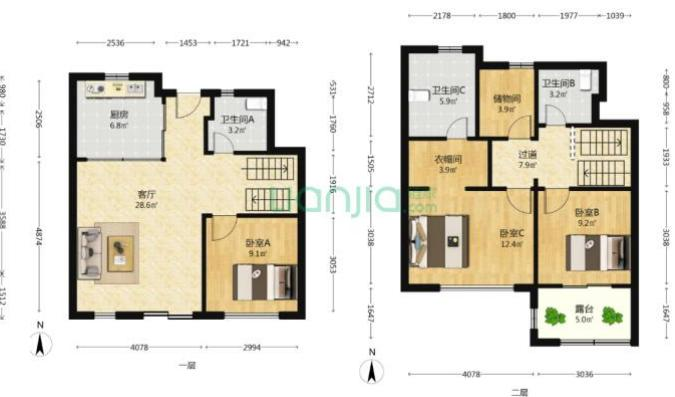

# 青浦赵巷

6F上叠184m²，带奢华精装修+产权车位两面宽，8.0米，报价916万

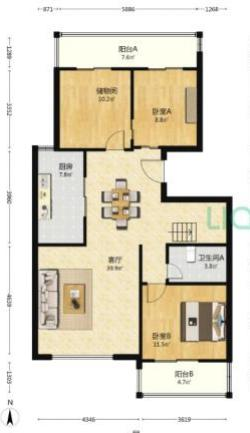

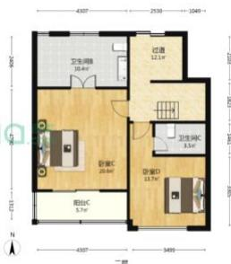

4F上叠  $124\mathrm{m}^2$  ，带奢华精装修+产权车位两面宽，7.2米，报价799万

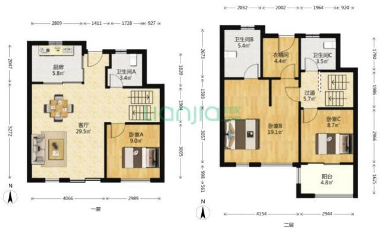

# 中铁建花语江南青浦赵巷

5F上叠159m²，毛坯+60m²阁楼两面宽，7.2米，报价788万

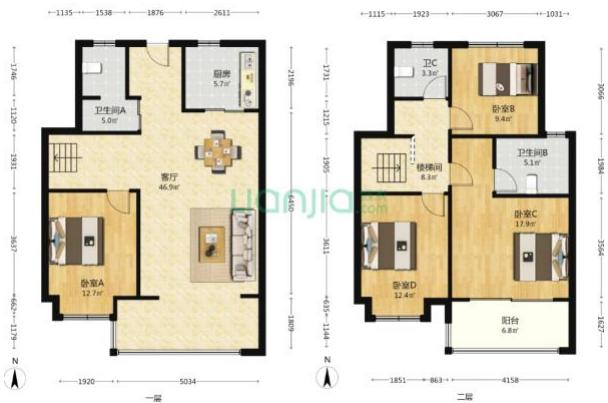

5F下叠165-168m²两面宽，7.2米，暂无挂牌

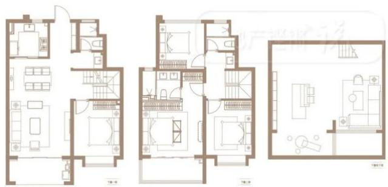

# 同济晶萃松江 泗泾

4F边套下叠141m²，带花园+精装修+地下室+产权车位两面宽，7.3米，报价899万

4F边套上叠117m²，带精装修+大阁楼露台两面宽，7.3米，报价690万

# 2.9 总结

1、泗泾为松江第二梯队板块，与洞泾同级，两板块均属强轨交外溢属性，客户重叠度高，板块之间强竞争分流，但泗泾配套成熟度远优于洞泾。松江新城板块发展早，客户内生地缘属性明显，与松江新城板块客户重叠约  $10 - 20\%$  ，竞争关系较小。

2、公寓市场：新房流速下行明显，二手次新房快速降价存量大，未来市场销售承压，预计产品承价能力将进一步削弱。泗泾新房招商时代潮派主力在售，TOD综合体项目，仅首开和二开时100%去化，之后开盘去化率快速下滑，月均流速24年99套，25年47套，下行明显，叠加全市市场下行周期及板块客户快速减少因素，而洋房实现溢价及热销，源于套数少（60套），销售期24.10月-25.2月为上海旺季。泗泾板块市场从“新房主导”转向“二手房主导”，2025年“二手/新房”成交比值突破1.8；公寓类产品是交易核心，别墅类产品有限；二手房呈现“量稳价跌”特征，对公寓类新房形成的分流最为显著。公寓次新房典型代表项目多盘破发，近三年二手成交价格降幅达30-40%，未来对新房市场冲击较大。

3、低密市场：泗泾近年低密新房供应稀缺，新规产品处于市场空白窗口期，未来竞争主要考虑与一路之隔03-05地块产品差异化竞争。泗泾近3年近三年低密产品仅1盘供应(花语天境160m²联排产品，成交总价段900-1000万)，洞泾叠加主力成交600-900万，100-160m²，联排主力成交800-1300万，120-160m²，近2年保利西郊和煦集中供应130m²刚需型联排，去化表现优异，但同时对于联排客户短期消耗较快，其二期新盘新规叠加首发，去化表现优于联排。

# 03 客户及产品定位分析

参考竞品地缘客户挖掘较深，地缘客户占比逐步走低，本案上游外溢客户比例预计会进一步提升，本案客户建议如下：

本案客户松江地缘客户50%，上游价格积压外溢客（闵行为主、徐汇补充）45%，其他5%

# 竞品客户参考

华发海上都荟

高层：松江  $63\% +$  闵行等市区21%；叠墅：松江  $60\% +$  闵行浦东等市区31%

保利西郊和煦（一期）&领墅（二期）

洋房：地缘57%，闵行39%；联排：地缘58%，闵行34%，其他8%

招商时代潮派：泗泾本地客户占比快速降低来到5成左右，说明对于板块内部的挖掘程度较深，同时结合宏观数据说明本版块客户被2手市场消化的速度正在逐步加快，

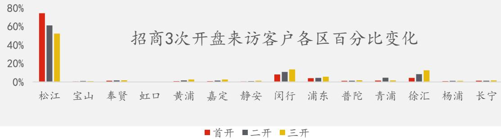

# 3.2 产品定位要点1：尽量不做或降低公寓类产品占比

■ 泗泾板块内招商时代潮派项目以公寓产品为主，去化流速逐步走低，刚需外溢客户减少，同时地缘客户挖掘较深占比也在逐步降低；预判明年公寓刚需市场去化流速和承价能力将进一步走低，同时公寓类二手房分流压力较大，本案建议减少或者不考虑公寓产品类型，差异化突围。

招商时代潮派历次开盘去化情况  

<table><tr><td>本次开盘时间</td><td>开盘批次</td><td>本批物业类型</td><td>本期供应 套数</td><td>当天去化 套数</td><td>当天去化率</td><td>本期单价</td></tr><tr><td>2024年6月28日</td><td>首开</td><td>小高层</td><td>234</td><td>234</td><td>100%</td><td>49701</td></tr><tr><td>2024年7月28日</td><td>加推</td><td>小高层、洋房</td><td>123</td><td>123</td><td>100%</td><td>49500</td></tr><tr><td>2024年9月15日</td><td>加推</td><td>小高层</td><td>102</td><td>45</td><td>44%</td><td>49803</td></tr><tr><td>2024年10月1日</td><td>加推</td><td>小高层</td><td>146</td><td>31</td><td>21%</td><td>51075</td></tr><tr><td>2024年11月15日</td><td>加推</td><td>高层</td><td>136</td><td>38</td><td>28%</td><td>51664</td></tr><tr><td>2024年12月25日</td><td>加推</td><td>小高层、洋房</td><td>160</td><td>90</td><td>56%</td><td>53168</td></tr><tr><td>2025年2月16日</td><td>加推</td><td>小高层、洋房</td><td>153</td><td>50</td><td>33%</td><td>52377</td></tr><tr><td>2025年3月30日</td><td>加推</td><td>小高层</td><td>81</td><td>24</td><td>30%</td><td>51086</td></tr><tr><td>2025年5月20日</td><td>加推</td><td>小高层</td><td>133</td><td>15</td><td>11%</td><td>50756</td></tr><tr><td>2025年6月29日</td><td>加推</td><td>小高层</td><td>238</td><td>20</td><td>8%</td><td>52743</td></tr><tr><td>2025年12月24日</td><td>加推</td><td>中高层</td><td>108</td><td>9</td><td>平推</td><td>50105</td></tr></table>

# 3.2 产品定位要点1：尽量不做或降低公寓类产品占比

■如因总图限制需配置少量洋房，需配置少量洋房，总阶段严控在600万以内，极致挖掘产品附加值，提升与次新二手房的产品竞争力。

泗泾公寓近三年（2023-2025年）面积段X总价段交叉  

<table><tr><td rowspan="2">面积段</td><td colspan="2">300万以内</td><td colspan="2">300-400万元</td><td colspan="2">400-500万元</td><td colspan="2">500-600万元</td><td colspan="2">600-700万元</td><td colspan="2">700-900万元</td><td colspan="2">900万以上</td><td colspan="2">汇总</td><td></td></tr><tr><td>供应</td><td>成交</td><td>供应</td><td>成交</td><td>供应</td><td>成交</td><td>供应</td><td>成交</td><td>供应</td><td>成交</td><td>供应</td><td>成交</td><td>供应</td><td>成交</td><td>供应</td><td>成交</td><td>成交</td></tr><tr><td>80m²以下</td><td>18</td><td>129</td><td>22</td><td>140</td><td>0</td><td>10</td><td>0</td><td>0</td><td>0</td><td>0</td><td>0</td><td>0</td><td>0</td><td>0</td><td>40</td><td>279</td><td></td></tr><tr><td>80-90m²</td><td>0</td><td>1</td><td>18</td><td>96</td><td>262</td><td>256</td><td>0</td><td>0</td><td>0</td><td>0</td><td>0</td><td>0</td><td>0</td><td>0</td><td>280</td><td>353</td><td></td></tr><tr><td>90-100m²</td><td>0</td><td>3</td><td>0</td><td>1</td><td>853</td><td>617</td><td>354</td><td>572</td><td>0</td><td>1</td><td>0</td><td>0</td><td>0</td><td>0</td><td>1207</td><td>1194</td><td></td></tr><tr><td>100-110m²</td><td>0</td><td>0</td><td>0</td><td>0</td><td>247</td><td>265</td><td>172</td><td>246</td><td>0</td><td>5</td><td>0</td><td>0</td><td>0</td><td>0</td><td>419</td><td>516</td><td></td></tr><tr><td>110-120m²</td><td>0</td><td>0</td><td>0</td><td>0</td><td>0</td><td>0</td><td>0</td><td>1</td><td>0</td><td>1</td><td>0</td><td>0</td><td>0</td><td>0</td><td>0</td><td>2</td><td></td></tr><tr><td>120-130m²</td><td>0</td><td>0</td><td>0</td><td>0</td><td>0</td><td>0</td><td>0</td><td>84</td><td>180</td><td>106</td><td>0</td><td>20</td><td>0</td><td>0</td><td>180</td><td>210</td><td></td></tr><tr><td>130-140m²</td><td>0</td><td>0</td><td>0</td><td>1</td><td>0</td><td>0</td><td>0</td><td>29</td><td>1</td><td>9</td><td>0</td><td>0</td><td>0</td><td>0</td><td>1</td><td>39</td><td></td></tr><tr><td>140-160m²</td><td>0</td><td>0</td><td>0</td><td>0</td><td>0</td><td>0</td><td>0</td><td>0</td><td>58</td><td>30</td><td>61</td><td>93</td><td>0</td><td>0</td><td>119</td><td>123</td><td></td></tr><tr><td>160-180m²</td><td>0</td><td>0</td><td>0</td><td>0</td><td>0</td><td>0</td><td>0</td><td>0</td><td>0</td><td>0</td><td>11</td><td>0</td><td>0</td><td>0</td><td>11</td><td>0</td><td></td></tr><tr><td>180-200m²</td><td>0</td><td>0</td><td>0</td><td>0</td><td>0</td><td>0</td><td>0</td><td>0</td><td>0</td><td>0</td><td>0</td><td>4</td><td>0</td><td>0</td><td>0</td><td>4</td><td></td></tr><tr><td>200-220m²</td><td>0</td><td>0</td><td>0</td><td>0</td><td>0</td><td>0</td><td>0</td><td>0</td><td>0</td><td>0</td><td>0</td><td>0</td><td>0</td><td>0</td><td>0</td><td>0</td><td></td></tr><tr><td>220-240m²</td><td>0</td><td>0</td><td>0</td><td>0</td><td>0</td><td>0</td><td>0</td><td>0</td><td>0</td><td>0</td><td>0</td><td>0</td><td>0</td><td>1</td><td>0</td><td>1</td><td></td></tr><tr><td>240-260m²</td><td>0</td><td>0</td><td>0</td><td>0</td><td>0</td><td>0</td><td>0</td><td>0</td><td>0</td><td>0</td><td>0</td><td>0</td><td>0</td><td>0</td><td>0</td><td>0</td><td></td></tr><tr><td>260-300m²</td><td>0</td><td>0</td><td>0</td><td>0</td><td>0</td><td>0</td><td>0</td><td>0</td><td>0</td><td>0</td><td>0</td><td>0</td><td>0</td><td>0</td><td>0</td><td>0</td><td></td></tr><tr><td>300m²以上</td><td>0</td><td>0</td><td>0</td><td>0</td><td>0</td><td>0</td><td>0</td><td>0</td><td>0</td><td>0</td><td>0</td><td>0</td><td>0</td><td>0</td><td>0</td><td>0</td><td></td></tr><tr><td>汇总</td><td>18</td><td>133</td><td>40</td><td>238</td><td>1362</td><td>1148</td><td>526</td><td>932</td><td>239</td><td>152</td><td>72</td><td>117</td><td>0</td><td>0</td><td>2257</td><td>2720</td><td></td></tr></table>

洞泾公寓近三年（2023-2025年）面积段X总阶段交叉  

<table><tr><td rowspan="2">面积段</td><td colspan="2">300万以下</td><td colspan="2">300-400万元</td><td colspan="2">400-500万元</td><td colspan="2">500-600万元</td><td colspan="2">600万以上</td><td colspan="2">汇总</td></tr><tr><td>供应</td><td>成交</td><td>供应</td><td>成交</td><td>供应</td><td>成交</td><td>供应</td><td>成交</td><td>供应</td><td>成交</td><td>供应</td><td>成交</td></tr><tr><td>80㎡以下</td><td>0</td><td>4</td><td>43</td><td>14</td><td>48</td><td>0</td><td>0</td><td>0</td><td>0</td><td>0</td><td>91</td><td>18</td></tr><tr><td>80-90㎡</td><td>0</td><td>1</td><td>33</td><td>17</td><td>20</td><td>0</td><td>0</td><td>0</td><td>0</td><td>0</td><td>53</td><td>18</td></tr><tr><td>90-100㎡</td><td>0</td><td>0</td><td>495</td><td>247</td><td>794</td><td>656</td><td>0</td><td>0</td><td>0</td><td>0</td><td>1289</td><td>903</td></tr><tr><td>100-110㎡</td><td>0</td><td>0</td><td>0</td><td>3</td><td>881</td><td>650</td><td>94</td><td>4</td><td>0</td><td>0</td><td>975</td><td>657</td></tr><tr><td>110-120㎡</td><td>0</td><td>0</td><td>0</td><td>0</td><td>0</td><td>3</td><td>57</td><td>54</td><td>0</td><td>0</td><td>57</td><td>57</td></tr><tr><td>120-130㎡</td><td>0</td><td>0</td><td>0</td><td>0</td><td>0</td><td>1</td><td>155</td><td>123</td><td>18</td><td>21</td><td>173</td><td>145</td></tr><tr><td>130-140㎡</td><td>0</td><td>0</td><td>0</td><td>0</td><td>0</td><td>0</td><td>0</td><td>0</td><td>0</td><td>0</td><td>0</td><td>0</td></tr><tr><td>140-160㎡</td><td>0</td><td>0</td><td>0</td><td>0</td><td>0</td><td>0</td><td>0</td><td>0</td><td>0</td><td>0</td><td>0</td><td>0</td></tr><tr><td>160-180㎡</td><td>0</td><td>0</td><td>0</td><td>0</td><td>0</td><td>0</td><td>0</td><td>0</td><td>0</td><td>6</td><td>0</td><td>6</td></tr><tr><td>180-200㎡</td><td>0</td><td>0</td><td>0</td><td>0</td><td>0</td><td>0</td><td>0</td><td>0</td><td>0</td><td>0</td><td>0</td><td>0</td></tr><tr><td>200-220㎡</td><td>0</td><td>0</td><td>0</td><td>0</td><td>0</td><td>0</td><td>0</td><td>0</td><td>0</td><td>0</td><td>0</td><td>0</td></tr><tr><td>220-240㎡</td><td>0</td><td>0</td><td>0</td><td>0</td><td>0</td><td>0</td><td>0</td><td>0</td><td>0</td><td>0</td><td>0</td><td>0</td></tr><tr><td>240-260㎡</td><td>0</td><td>0</td><td>0</td><td>0</td><td>0</td><td>0</td><td>0</td><td>0</td><td>0</td><td>0</td><td>0</td><td>0</td></tr><tr><td>260-300㎡</td><td>0</td><td>0</td><td>0</td><td>0</td><td>0</td><td>0</td><td>0</td><td>0</td><td>0</td><td>0</td><td>0</td><td>0</td></tr><tr><td>300㎡以上</td><td>0</td><td>0</td><td>0</td><td>0</td><td>0</td><td>0</td><td>0</td><td>0</td><td>0</td><td>0</td><td>0</td><td>0</td></tr><tr><td>汇总</td><td>0</td><td>5</td><td>571</td><td>281</td><td>1743</td><td>1310</td><td>306</td><td>181</td><td>18</td><td>27</td><td>2638</td><td>1804</td></tr></table>

# 3.2 产品定位要点2：联排客户短期消耗较快，新规叠加产品最大化

■ 泗泾洞泾板块联排产品总价主力在1300万以内，叠加总价主力在900万以内，客户承价天花板明显。近2年保利西郊和煦集中供应  $130\mathrm{m}^2$  刚需型联排，去化表现优异，但同时联排客户短期消耗较快，其二期新盘新规叠加首发，去化表现优于联排。  
■ 同时考虑相邻泗泾03-05号地块（计划打造洋房+联排）差异化竞争，本案建议采取全叠加产品方向为佳，主力面积段参考主力在140m²左右，次主力在160m²、及120m²左右。

泗泾联排近三年（2023-2025年）面积段X总阶段交叉  

<table><tr><td rowspan="2">面积段</td><td colspan="2">900-1000万元</td><td colspan="2">1000-1100万元</td><td colspan="2">1100-1200万元</td><td colspan="2">1200-1300万元</td></tr><tr><td>供应</td><td>成交</td><td>供应</td><td>成交</td><td>供应</td><td>成交</td><td>供应</td><td>成交</td></tr><tr><td rowspan="2">140-160m²</td><td colspan="8">中国铁建花语天境160㎡联排</td></tr><tr><td>48</td><td>48</td><td>6</td><td>6</td><td>0</td><td>0</td><td>0</td><td>0</td></tr><tr><td>160-180m²</td><td>0</td><td>1</td><td>0</td><td>0</td><td>0</td><td>2</td><td>0</td><td>0</td></tr><tr><td rowspan="2">180-200m²</td><td rowspan="2">0</td><td colspan="7">金地自在城165/175㎡联排</td></tr><tr><td>0</td><td>0</td><td>0</td><td>0</td><td>0</td><td>0</td><td>0</td></tr><tr><td>200-220m²</td><td>0</td><td>0</td><td>0</td><td>0</td><td>0</td><td>0</td><td>0</td><td>1</td></tr><tr><td rowspan="2">汇总</td><td rowspan="2">48</td><td rowspan="2">49</td><td rowspan="2">6</td><td>6</td><td>0</td><td>2</td><td>0</td><td>1</td></tr><tr><td>新城上坤樾山2</td><td>14㎡</td><td colspan="3">联排</td></tr></table>

洞泾叠加近三年（2023-2025年）面积段X总阶段交叉  

<table><tr><td>面积段</td><td>400-500万元</td><td>500-600万元</td><td>600-700万元</td><td>700-800万元</td><td>800-900万元</td><td>900-1000万
元</td></tr><tr><td>80㎡以下</td><td>0</td><td>0</td><td>0</td><td>0</td><td>0</td><td>0</td></tr><tr><td>80-90㎡</td><td>2</td><td>16</td><td>1</td><td>0</td><td>0</td><td>0</td></tr><tr><td>90-100㎡</td><td>0</td><td>0</td><td>0</td><td>0</td><td>0</td><td>0</td></tr><tr><td>100-110㎡</td><td>0</td><td>0</td><td>0</td><td>0</td><td>0</td><td>0</td></tr><tr><td>110-120㎡</td><td>0</td><td>1</td><td>36</td><td>0</td><td>0</td><td>0</td></tr><tr><td>120-130㎡</td><td>0</td><td>2</td><td>2</td><td>26</td><td>7</td><td>0</td></tr><tr><td>130-140㎡</td><td>0</td><td>0</td><td>0</td><td>40</td><td>14</td><td>6</td></tr><tr><td>140-160㎡</td><td>0</td><td>0</td><td>0</td><td>0</td><td>28</td><td>12</td></tr><tr><td>160-180㎡</td><td>0</td><td>0</td><td>0</td><td>0</td><td>2</td><td>0</td></tr><tr><td>180-200㎡</td><td>0</td><td>0</td><td>0</td><td>0</td><td>1</td><td>2</td></tr><tr><td>200㎡以上</td><td>0</td><td>0</td><td>0</td><td>0</td><td>0</td><td>0</td></tr></table>

洞泾联排近三年（2023-2025年）面积段X总价段交叉  

<table><tr><td>面积段</td><td>700-800万
元</td><td>800-900万
元</td><td>900-1000
万元</td><td>1000-1100
万元</td><td>1100-1200
万元</td><td>1200-1300
万元</td><td>1300-1400
万元</td><td>1400-1500
万元</td><td>1500万元以上</td></tr><tr><td>100㎡以下</td><td>0</td><td>0</td><td>0</td><td>0</td><td>0</td><td>0</td><td>0</td><td>0</td><td>0</td></tr><tr><td>100-120m</td><td>56</td><td>25</td><td>0</td><td>0</td><td>0</td><td>0</td><td>0</td><td>0</td><td>0</td></tr><tr><td>120-140m</td><td>1</td><td>38</td><td>94</td><td>16</td><td>0</td><td>0</td><td>0</td><td>0</td><td>0</td></tr><tr><td>140-160m</td><td>0</td><td>0</td><td>9</td><td>22</td><td>15</td><td>0</td><td>0</td><td>0</td><td>0</td></tr><tr><td>160-180m</td><td>0</td><td>0</td><td>0</td><td>0</td><td>3</td><td>7</td><td>0</td><td>0</td><td>0</td></tr><tr><td>180-200m</td><td>0</td><td>0</td><td>0</td><td>0</td><td>7</td><td>19</td><td>8</td><td>2</td><td>2</td></tr><tr><td>200㎡以上</td><td>0</td><td>0</td><td>0</td><td>0</td><td>0</td><td>0</td><td>0</td><td>0</td><td>0</td></tr></table>

900万（叠加总价天花板）

1300万（联排总价天花板）

# 3.2 产品定位要点2：叠加客户厚度更强，新规叠加产品最大化

■低密类产品客群主要源于泗泾本板块及上游闵行、徐汇等外溢客户高层置换低密的总价逻辑。从成交总价结构来看，500-800万对应叠加置换客户为主，700-1000万对应联排置换客户为主，其中500-800万客户厚度最厚，打造叠加产品的相对安全度更高。

泗泾本板块及上游闵行公寓市场近3年分总价段供求  

<table><tr><td rowspan="2">总阶段</td><td colspan="4">泗泾板块</td><td colspan="4">上游闵行区</td></tr><tr><td>2023年</td><td>2024年</td><td>2025年</td><td>合计</td><td>2023年</td><td>2024年</td><td>2025年</td><td>合计</td></tr><tr><td>200万元以下</td><td>0</td><td>2</td><td>0</td><td>2</td><td>4</td><td>4</td><td>0</td><td>8</td></tr><tr><td>200-300万元</td><td>127</td><td>2</td><td>2</td><td>131</td><td>8</td><td>34</td><td>6</td><td>48</td></tr><tr><td>300-400万元</td><td>196</td><td>29</td><td>14</td><td>239</td><td>55</td><td>360</td><td>163</td><td>578</td></tr><tr><td>400-500万元</td><td>581</td><td>396</td><td>178</td><td>1155</td><td>525</td><td>779</td><td>694</td><td>1998</td></tr><tr><td>500-600万元</td><td>318</td><td>266</td><td>359</td><td>943</td><td>1326</td><td>701</td><td>538</td><td>2565</td></tr><tr><td>600-700万元</td><td>53</td><td>101</td><td>11</td><td>165</td><td>1650</td><td>1565</td><td>930</td><td>4145</td></tr><tr><td>700-800万元</td><td>49</td><td>34</td><td>44</td><td>127</td><td>1591</td><td>1720</td><td>570</td><td>3881</td></tr><tr><td>800-900万元</td><td>3</td><td>0</td><td>3</td><td>6</td><td>899</td><td>531</td><td>526</td><td>1956</td></tr><tr><td>900-1000万元</td><td>52</td><td>2</td><td>0</td><td>54</td><td>1036</td><td>283</td><td>226</td><td>1545</td></tr><tr><td>1000-1500万元</td><td>9</td><td>1</td><td>2</td><td>12</td><td>583</td><td>880</td><td>576</td><td>2039</td></tr><tr><td>1500-2000万元</td><td>0</td><td>0</td><td>0</td><td>0</td><td>234</td><td>130</td><td>173</td><td>537</td></tr><tr><td>2000-2500万元</td><td>0</td><td>0</td><td>0</td><td>0</td><td>99</td><td>40</td><td>32</td><td>171</td></tr><tr><td>2500-3000万元</td><td>0</td><td>0</td><td>0</td><td>0</td><td>8</td><td>4</td><td>0</td><td>12</td></tr><tr><td>3000万元以上</td><td>0</td><td>0</td><td>0</td><td>0</td><td>2</td><td>3</td><td>3</td><td>8</td></tr></table>

叠加置换客户

联排置换客户

# 3.2 产品定位要点2：新规叠加产品供应量可控，存在窗口机会

近三年松江叠加及联排产品合计预计将消耗2000组以上客户，而25年保利、国贸项目开始，均为新规低密产品，附加值得到明显提升，且叠加产品开始全面按照精装方式销售，本案考虑新规下的叠加产品仍存市场空间，同时叠加自住舒适度有机会优于保利西郊和煦130m²联排产品。

松江区23-25年共入市12个项目、1260套叠加产品，主流面积135-160m²，少量100-130m²，65%以上盘为4F叠加；  
松江区23-25年共入市8个项目、769套联排产品，小联排130m²左右，中联排160m²左右，大联排200m²左右。

2023年-2026年松江区含叠加项目全盘点  

<table><tr><td>首开年份</td><td>含叠加项目</td><td>板块</td><td>层数</td><td>户型面积段</td><td>套数</td></tr><tr><td rowspan="4">2023</td><td>中铁建星樾云涧</td><td>松江新城</td><td>5F叠加</td><td>叠加134-157㎡</td><td>70</td></tr><tr><td>中交松香源著</td><td>车墩</td><td>4F叠加</td><td>叠加117-124㎡</td><td>72</td></tr><tr><td>中企誉品银湖湾</td><td>松江新城</td><td>4F叠加</td><td>叠加145-155㎡</td><td>148</td></tr><tr><td>招商云澜湾</td><td>松江老城</td><td>4F叠加</td><td>叠加135-141㎡</td><td>140</td></tr><tr><td rowspan="3">2024</td><td>香港兴业兴云间</td><td>洞泾</td><td>4F叠加</td><td>叠加178-192㎡</td><td>4</td></tr><tr><td>华发海上都荟</td><td>洞泾</td><td>4/6F叠加</td><td>叠加90-136㎡</td><td>198</td></tr><tr><td>恒都云璟</td><td>洞泾</td><td>4F叠加</td><td>叠加152-160㎡</td><td>24</td></tr><tr><td rowspan="5">2025</td><td>国贸海屿余山</td><td>佘山</td><td>5F叠加</td><td>叠加118-165㎡</td><td>127</td></tr><tr><td>国贸海上原墅（新规）</td><td>松江新城</td><td>5F叠加</td><td>叠加140-150㎡</td><td>132</td></tr><tr><td>呆利西郊和煦领墅（新规）</td><td>洞泾</td><td>4F叠加</td><td>叠加140-150㎡</td><td>128</td></tr><tr><td>翠屿原墅（新规）</td><td>松江新城</td><td>4F叠加</td><td>叠加150-160㎡</td><td>150</td></tr><tr><td>中铁建西派云间（新规）</td><td>松江新城</td><td>4F叠加</td><td>叠加145-155㎡</td><td>68</td></tr><tr><td>2026</td><td>中铁春江逸景（新规）</td><td>洞泾</td><td>预计5-6F叠加</td><td>暂不详</td><td>24</td></tr><tr><td colspan="5">合计</td><td>1285套</td></tr></table>

2023年-2026年松江区含联排项目全盘点  

<table><tr><td>首开年份</td><td>含叠加项目</td><td>板块</td><td>户型面积段</td><td>套数</td></tr><tr><td rowspan="2">2023</td><td>中铁建花语天境</td><td>泗泾</td><td>联排160㎡</td><td>102</td></tr><tr><td>中建大椿嘉利椿廷</td><td>洞泾</td><td>联排115-150㎡</td><td>95</td></tr><tr><td rowspan="3">2024</td><td>香港兴业兴云间</td><td>洞泾</td><td>联排193-197㎡</td><td>54</td></tr><tr><td>保利西郊和煦</td><td>洞泾</td><td>联排126-165㎡</td><td>104</td></tr><tr><td>恒都云璟</td><td>洞泾</td><td>联排155-158㎡</td><td>96</td></tr><tr><td rowspan="3">2025</td><td>国贸海上原墅（新规）</td><td>松江新城</td><td>联排155-200㎡</td><td>162</td></tr><tr><td>保利西郊和煦领墅（新规）</td><td>洞泾</td><td>联排132-195㎡</td><td>141</td></tr><tr><td>翠屿原墅（新规）</td><td>松江新城</td><td>联排190-200㎡</td><td>16</td></tr><tr><td>2026</td><td>03-05地块（新规）</td><td>泗泾</td><td>预计160-200㎡</td><td>预计70</td></tr><tr><td colspan="4">合计</td><td>839套</td></tr></table>

# 3.2 产品定位要点2：新规叠加产品价值迭代显著、精装交付，存在窗口机会

<table><tr><td rowspan="2">序号</td><td rowspan="2">部位</td><td>原规范要求</td><td>新规范要求</td><td rowspan="2">方松应用情况(松江区)</td><td rowspan="2">上海其他区应用情况</td></tr><tr><td>低密产品</td><td>低密产品</td></tr><tr><td>1</td><td>阳台</td><td>只能设置1个阳台,单个面积不超过8㎡</td><td>每户阳台总面积不大于建筑面积的10%,且不大于16㎡</td><td>按照新规要求</td><td>按照新规要求</td></tr><tr><td>2</td><td>飘窗</td><td>客厅/卧室/卫生间可以设置,厨房不能设。</td><td>客厅/卧室/卫生间可以设置,厨房也可以设置。</td><td>按照新规要求</td><td>按新规要求</td></tr><tr><td>3</td><td>户内挑空</td><td>不能设置</td><td>下叠和联排可以设置客厅局部挑空</td><td>下叠和联排可以设置客厅局部挑空</td><td>浦东不可以设置,青浦和奉贤等其他区需要沟通明确。</td></tr><tr><td>4</td><td>地下室</td><td>联排/下叠可以设置地下储藏室</td><td>联排/下叠/上叠都可以设置储藏室</td><td>联排/下叠设置储藏室,下叠设置私家电梯厅</td><td>联排/下叠/上叠都可以设置储藏室</td></tr><tr><td>5</td><td>采光井</td><td>宽度不超过1.8米</td><td>宽度不超过1.8米</td><td>宽度不超过1.8米</td><td>宽度不超过1.8米</td></tr><tr><td>6</td><td>露台</td><td>联排/叠加可以设置</td><td>联排/叠加可以设置</td><td>联排/叠加可以设置</td><td>联排/叠加可以设置</td></tr><tr><td>7</td><td>屋顶花园</td><td>不可以,只能设置闷顶</td><td>可以设置屋顶花园</td><td>设置屋顶花园</td><td>青浦区可以设置屋顶花园,其他区需要沟通规划确定</td></tr><tr><td>8</td><td>室外庭院</td><td>叠加不可以</td><td>联排/叠加可以设置</td><td>联排/叠加设置庭院赠送</td><td>青浦区可以设置,其他区需要沟通确定</td></tr><tr><td>9</td><td>封闭内天井</td><td>不可以设置</td><td>联排可以设置</td><td>联排设置内天井</td><td>其他区需要沟通规划审批确定</td></tr><tr><td>10</td><td>电梯井预留</td><td>不可以</td><td>可以设置预留电梯井</td><td>联排/叠加预留私家电梯井道</td><td>其他区需要沟通规划审批确定</td></tr><tr><td>11</td><td>一步阳台</td><td>不可以</td><td>面向景观的楼栋可以设进深≤0.75m的不计容一步阳台</td><td>方松未设置,泗泾项目可以设置</td><td>可以设置,具体楼栋需沟通规划审批确定</td></tr></table>

  
低密产品附加值赠送方式示意  
(以4叠为例)

# 3.2 产品定位要点3：低密业态存在品类优势，600万公寓类产品易被上游学区二手房分流

■ 泗泾、洞泾板块联排产品总价主力在1300万以内，叠加总价主力在900万以内，对标上游新房同总价段可以购买  $100 - 140\mathrm{m}^2$  公寓产品，本案低密新规产品PK上游公寓产品附加值高，墅类建筑对比公寓存在业态升级差异，存在市场竞争突围机会；  
■本案若打造公寓产品，由于上游二手房价格快速下跌，600万以内总价存在较大选择空间，且有更好的配套及学区资源，本板块新房置换PK上游地段置换的分流竞争压力较大，不建议过多打造公寓（洋房）类产品。

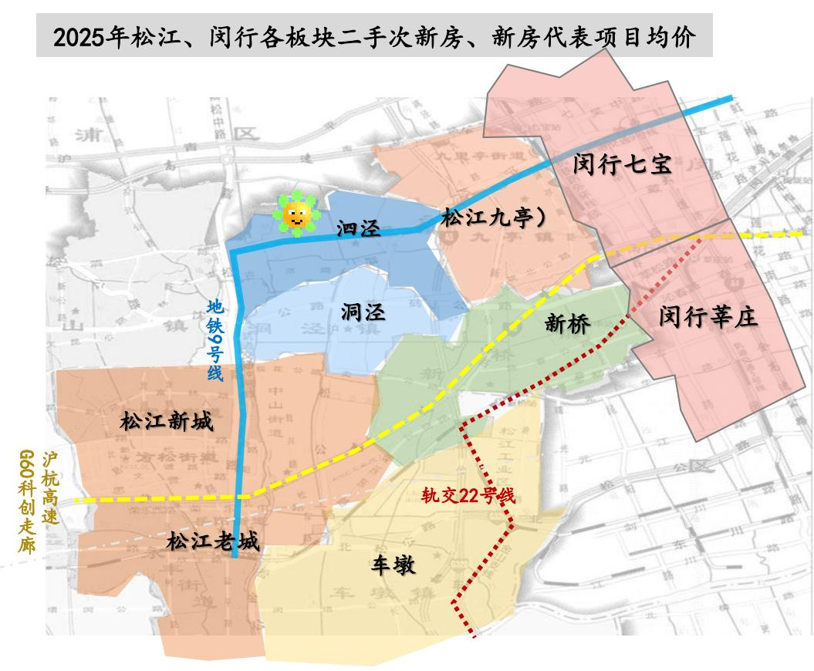

<table><tr><td rowspan="2">行政区</td><td rowspan="2">上游板块</td><td colspan="6">二手次新房代表</td><td colspan="4">一手新房公寓均价</td></tr><tr><td>小区</td><td>交付年份</td><td>户型</td><td>2022年成交价（万/㎡）</td><td>2025年成交单价(万/㎡)</td><td>2025年成交总价(万)</td><td>小区</td><td>户型</td><td>2025年成交单价(万/㎡)</td><td>2025年成交总价(万)</td></tr><tr><td rowspan="7">闵行</td><td rowspan="4">上游莘庄挂牌均价5万</td><td>好世鹿鸣苑</td><td>2000-2009</td><td>100m²</td><td>11.1</td><td>6.7</td><td>670</td><td rowspan="4">安高·海印华庭</td><td rowspan="4">119-143</td><td rowspan="4">预计8.25</td><td rowspan="4">980-1200</td></tr><tr><td>名都新城四期</td><td>2005-2006</td><td>90m²</td><td>8.5</td><td>4.6-5.4</td><td>400-500</td></tr><tr><td>中祥哥德堡</td><td>2004</td><td>119m²</td><td>——</td><td>5.3</td><td>630</td></tr><tr><td>莘松1-9村</td><td>1983-1993</td><td>30-60m²</td><td>——</td><td>4.5-5.5</td><td>130-350</td></tr><tr><td rowspan="3">上游七宝挂牌均价6.23万</td><td>万科城市花园</td><td>1994-1998</td><td>73-102m²</td><td>——</td><td>4.7-5.3</td><td>350-550</td><td rowspan="3">皇都花园</td><td rowspan="3">97-160</td><td rowspan="3">7.8-8.2</td><td rowspan="3">700-1300</td></tr><tr><td>东方花园二期</td><td>2003-2006</td><td>96-133m²</td><td>8</td><td>5.7</td><td>500-750</td></tr><tr><td>白雪公主（对口七宝文来学校）</td><td>2004</td><td>82-115m²</td><td>9.7</td><td>5.2</td><td>400-600</td></tr><tr><td rowspan="5">松江</td><td rowspan="5">上游九亭</td><td>贝尚湾（标杆小区）</td><td>2008-2012</td><td>89-119m²</td><td>7.63</td><td>5.0-5.3</td><td>440-630</td><td rowspan="5" colspan="4">——</td></tr><tr><td>九城湖滨国际</td><td>2007-2009</td><td>85m²</td><td>6.7</td><td>4.6</td><td>390</td></tr><tr><td rowspan="2">象屿都城</td><td rowspan="2">2008-2013</td><td>93m²</td><td>5.4</td><td>3.7</td><td>344</td></tr><tr><td>119m²</td><td>4.43</td><td>3.6</td><td>428</td></tr><tr><td>象屿虹桥悦府</td><td>2019</td><td>93m²</td><td>6.95</td><td>4.9</td><td>460</td></tr></table>

600万以内同总价泗泾新房公寓与上游二手房公寓地段升级置换竞争

同总价上游公寓与泗泾板块新规低密产品置换竞争

# 竞争策略

1、洋房总价上限控600万，叠墅总价上限控900万，

差异化竞争打造低密纯粹社区

2、泗泾1.3公里成熟圈+全维生活配套

3、发力精筑叠加产品

# 项目总体定位

泗泾成熟生活圈、环水精工纯低密改善社区

# 3.3 项目定位户配建议

> 土地指标：占地1.93万方，容积率1.2，计容建面2.32万方，限高24m，保障房5%。  
户配定位思路：

强功能、控总价、兼顾舒适度：4F叠加户均  $140\mathrm{m}^2$  占比  $80\%$  ，  $160\mathrm{m}^2$  占比  $20\%$  ，在4F叠加最大化的情况下，考虑补足容积率补充  $120\mathrm{m}^2$  6F高性价比叠加/或7F120m²3+1房洋房，布局在景观优势较差的区域。

考虑竞争突围，经济型小户型叠加产品全精装交付(不包含地下室，但包含隔板），叠拼产品考虑新房和二手房竞争，建议打造三面宽户型为主。

<table><tr><td>产品建议</td><td>面积段m2(计容面积)</td><td>户型</td><td>参考户型说明</td><td>套数占比</td><td>精装成本(元/m2)</td></tr><tr><td rowspan="2">4F叠加</td><td>套均140</td><td>2.5-3面宽</td><td>参考保利西郊和煦领墅叠墅产品,下叠挑空及天井赠送做足,上叠赠送屋顶花园,大露台</td><td>80%</td><td>3000</td></tr><tr><td>套均160</td><td>至少3面宽</td><td>只放在核心景观优势明显的区域,且为端套,双套房</td><td>20%</td><td>3000</td></tr><tr><td>6F叠加或7F洋房</td><td>套均120</td><td></td><td>优先排布洋房,如果中间层可以做挑空,做复式,如果不行,做平层;若排不下,排布3+1洋房产品</td><td>考虑补足容积率配置在景观优势较差的临路地段</td><td>叠加3000洋房2500</td></tr><tr><td colspan="2">售楼处、配套建议</td><td colspan="4">整体抬高,主入口面对南侧道路,东南角为佳</td></tr></table>

# 04 设计方案

# 4.1 规划边界条件梳理：基地周边情况

项目基地南侧和东侧现有住宅小区，西侧和北侧临河道和绿化，基地东侧贴临刘五公路。

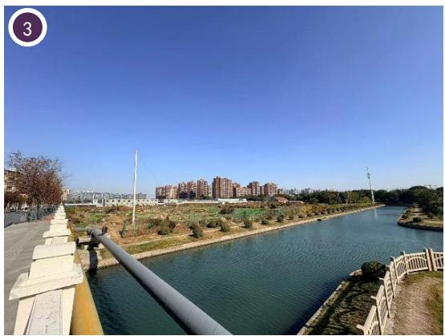

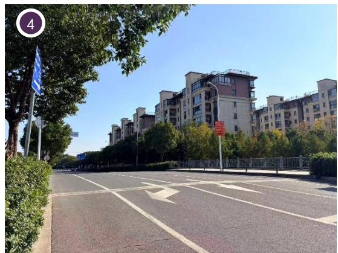

# 4.1 现有已征询规划设计条件梳理

# 地块规划设计条件：

占地面积：19732平方米；

容积率：1.2；

限高：24米；

建筑密度：无要求，实际方案审批按照不超  $40\%$  控制；

绿地率：  $35\%$  ；集中绿地率  $10\%$

保障房比例：5%（可沟通取消）

装修比例：暂无；

# 建筑高度计算标准：

起算点按照出入口道路标高+300控制；沿道路转角、重点地区和城市设计重要节点，可局

部提高建筑高度。50米及以下高度提高不超过7米，50米以上高度提高不超过11米建筑高度局部提高的部分水平投影面积占该地块住宅标准层水平投影面积之和的比例一般不大  $30\%$  。

现状道路条件；地块主入口以及消防车行都需布置在南侧道路

# 周边地块属性：

场地东、西、北侧 04-07为公园绿地（G1）总占地为  $4342 \mathrm{~m}^{2}$ ；

该地块设计时，需考虑跟周边绿地统一设计；保证景观资源充分利用；结合利用周边现状条件，在满足规范情况下合理设计。规划方面要满足可达性、功能性、关联性。

东侧与南侧还需满足与现状住宅的日照间距。

# 4.2 方案对比（按5%保障房取消排布）

  
方案一

<table><tr><td></td><td>套数</td><td>套数比</td><td>单户面积</td><td>面积</td><td>面积比</td><td>面宽
(M)</td></tr><tr><td>洋房
(7F)</td><td>56</td><td>33.53%</td><td>108</td><td>6048</td><td>26.53%</td><td>10.0</td></tr><tr><td>洋房
(7F)</td><td>7</td><td>4.19%</td><td>150</td><td>1050</td><td>4.61%</td><td>15.4</td></tr><tr><td>叠加
(4F)</td><td>64</td><td>38.32%</td><td>139/150</td><td>9178.4</td><td>40.26%</td><td>9.3</td></tr><tr><td>叠墅
(4F)</td><td>40</td><td>23.95%</td><td>170/160</td><td>6520</td><td>28.60%</td><td>9.7</td></tr><tr><td>住宅总计容</td><td>167</td><td>100%</td><td>/</td><td>22796.4</td><td>100%</td><td>/</td></tr></table>

# 方案二

三面宽叠加+7F洋房，示范区位置调整

<table><tr><td></td><td>套数</td><td>套数比</td><td>单户面积</td><td>面积</td><td>面积比</td><td>面宽
(M)</td></tr><tr><td>洋房
(7F)</td><td>56</td><td>32.75%</td><td>105</td><td>5880</td><td>25.79%</td><td>10.0</td></tr><tr><td>洋房
(7F)</td><td>7</td><td>4.09%</td><td>145</td><td>1015</td><td>4.45%</td><td>15.4</td></tr><tr><td>叠加
(4F)</td><td>68</td><td>39.77%</td><td>139/150</td><td>9501.4</td><td>41.68%</td><td>9.3</td></tr><tr><td>叠墅
(4F)</td><td>40</td><td>23.39%</td><td>170/160</td><td>6400</td><td>28.07%</td><td>9.7</td></tr><tr><td>住宅总计容</td><td>171</td><td>100%</td><td>/</td><td>22796.4</td><td>100%</td><td>/</td></tr></table>

# 4.2 方案对比（按5%保障房取消排布）

  
方案三

  
方案四

<table><tr><td></td><td>套数</td><td>套数比</td><td>单户面积</td><td>面积</td><td>面积比</td><td>面宽
(M)</td></tr><tr><td>叠加
(6F)</td><td>36</td><td>19.74%</td><td>125</td><td>4500</td><td>19.74%</td><td>7.5</td></tr><tr><td>叠加
(4F)</td><td>106</td><td>67.39%</td><td>139/150</td><td>15362.4</td><td>67.39%</td><td>8.2</td></tr><tr><td>叠墅
(4F)</td><td>18</td><td>19.74%</td><td>170/160</td><td>2934</td><td>12.87%</td><td>9.7</td></tr><tr><td>住宅总计容</td><td>160</td><td>100%</td><td>/</td><td>22796.4</td><td>100%</td><td>/</td></tr></table>

<table><tr><td></td><td>套数</td><td>套数比</td><td>单户面积</td><td>面积</td><td>面积比</td><td>面宽
(M)</td></tr><tr><td>叠加
(4F)</td><td>64</td><td>42.67%</td><td>139/150</td><td>9134.4</td><td>40.07%</td><td>7.8</td></tr><tr><td>叠加
(6F)</td><td>24</td><td>16.00%</td><td>139/150</td><td>3432</td><td>15.06%</td><td>7.8</td></tr><tr><td>叠加
(4F)</td><td>56</td><td>37.33%</td><td>170/160</td><td>9240</td><td>40.53%</td><td>9.7</td></tr><tr><td>叠墅
(6F)</td><td>6</td><td>4.00%</td><td>170/160</td><td>990</td><td>4.34%</td><td>9.7</td></tr><tr><td>住宅总计容</td><td>150</td><td>100%</td><td>/</td><td>22796.4</td><td>100%</td><td>/</td></tr></table>

# 方案一

# 方案一业态分析

<table><tr><td></td><td>套数</td><td>套数比</td><td>单户面积</td><td>面积</td><td>面积比</td><td>面宽
(M)</td></tr><tr><td>洋房
(7F)</td><td>56</td><td>33.53%</td><td>108</td><td>6048</td><td>26.53%</td><td>10.0</td></tr><tr><td>洋房
(7F)</td><td>7</td><td>4.19%</td><td>150</td><td>1050</td><td>4.61%</td><td>15.4</td></tr><tr><td>叠加
(4F)</td><td>64</td><td>38.32%</td><td>139/150</td><td>9178.4</td><td>40.26%</td><td>9.3</td></tr><tr><td>叠墅
(4F)</td><td>40</td><td>23.95%</td><td>170/160</td><td>6520</td><td>28.60%</td><td>9.7</td></tr><tr><td>住宅总计容</td><td>167</td><td>100%</td><td>/</td><td>22796.4</td><td>100%</td><td>/</td></tr></table>

# 路

# 规划

# 刘

# 五

用地红线

4F住宅建筑控制线

6F住宅建筑控制线

低层非居住建筑控制线

地库范围线

# 公

# 路

# 方案一体块示意图

108 洋房（7F）

150 洋房（7F）

143 叠墅（4F）

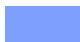

163 叠墅 (4F)

配套（2F）

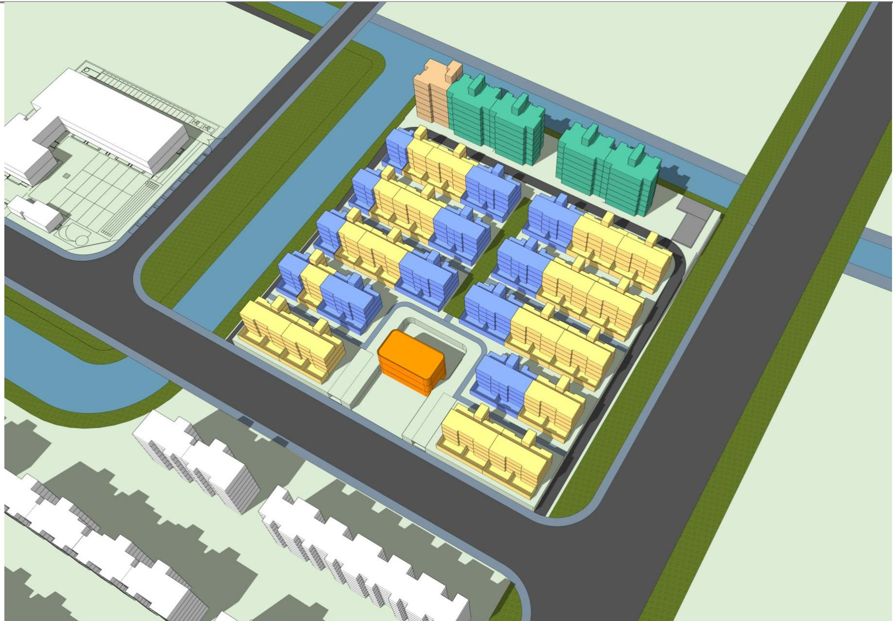

示范区方案一红线内用地  $1900 \mathrm{~m}^{2}$ , 红线外用地  $2000 \mathrm{~m}^{2}$ , 售楼处地上地下合计暂估  $800 \mathrm{~m}^{2}$  。  
■样板房：叠加和洋房实体样板房。

# 方案二 示范区位置调整

# 方案二——示范区位置调整尝试

图例： 105 洋房（7F）  
145 洋房 (7F)  
140 叠墅 (4F)  
160 叠墅（4F）  
配套（2F）  
社区门厅  
地库出入口

<table><tr><td></td><td>套数</td><td>套数比</td><td>单户面积</td><td>面积</td><td>面积比</td><td>面宽
(M)</td></tr><tr><td>洋房
(7F)</td><td>56</td><td>32.75%</td><td>105</td><td>5880</td><td>25.79%</td><td>10.0</td></tr><tr><td>洋房
(7F)</td><td>7</td><td>4.09%</td><td>145</td><td>1015</td><td>4.45%</td><td>15.4</td></tr><tr><td>叠加
(4F)</td><td>68</td><td>39.77%</td><td>139/150</td><td>9501.4</td><td>41.68%</td><td>9.3</td></tr><tr><td>叠墅
(4F)</td><td>40</td><td>23.39%</td><td>170/160</td><td>6400</td><td>28.07%</td><td>9.7</td></tr><tr><td>住宅总计容</td><td>171</td><td>100%</td><td>/</td><td>22796.4</td><td>100%</td><td>/</td></tr></table>

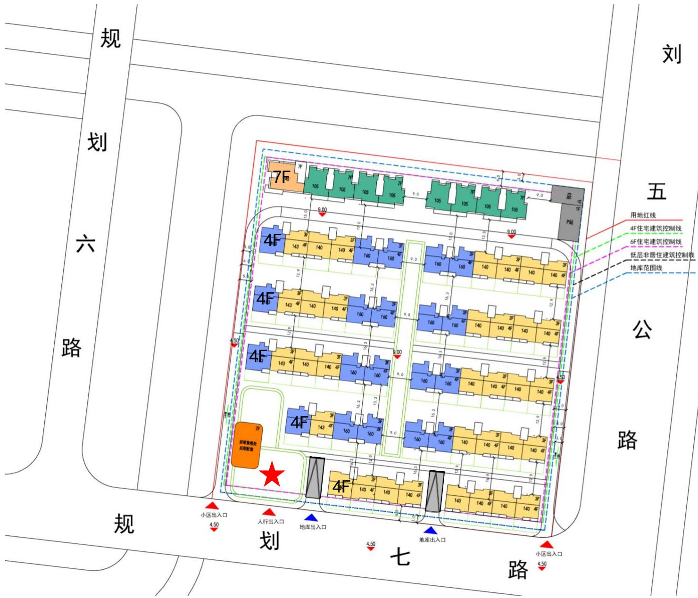

# 方案三

# 方案三——2-2.5面宽全叠加

图例： 125 叠墅 (6F)  
145 叠墅 (4F)  
163 叠墅（4F）  
配套（2F）  
社区门厅  
地库出入口

<table><tr><td></td><td>套数</td><td>套数比</td><td>单户面积</td><td>面积</td><td>面积比</td><td>面宽
(M)</td></tr><tr><td>叠加
(6F)</td><td>36</td><td>19.74%</td><td>125</td><td>4500</td><td>19.74%</td><td>7.5</td></tr><tr><td>叠加
(4F)</td><td>106</td><td>67.39%</td><td>139/150</td><td>15362.4</td><td>67.39%</td><td>8.1</td></tr><tr><td>叠墅
(4F)</td><td>18</td><td>19.74%</td><td>170/160</td><td>2934</td><td>12.87%</td><td>9.7</td></tr><tr><td>住宅总计容</td><td>160</td><td>100%</td><td>/</td><td>22796.4</td><td>100%</td><td>/</td></tr></table>

# 方案四

# 方案四——2+3面宽全叠加

图例： 143 叠墅（4F）  
143 叠墅 (6F)  
165 叠墅 (4F)  
165 叠墅 (6F)  
配套（2F）  
社区门厅  
地库出入口

<table><tr><td></td><td>套数</td><td>套数比</td><td>单户面积</td><td>面积</td><td>面积比</td><td>面宽
(M)</td></tr><tr><td>叠加
(4F)</td><td>64</td><td>42.67%</td><td>139/150</td><td>9134.4</td><td>40.07%</td><td>7.8</td></tr><tr><td>叠加
(6F)</td><td>24</td><td>16.00%</td><td>139/150</td><td>3432</td><td>15.06%</td><td>7.8</td></tr><tr><td>叠加
(4F)</td><td>56</td><td>37.33%</td><td>170/160</td><td>9240</td><td>40.53%</td><td>9.7</td></tr><tr><td>叠墅
(6F)</td><td>6</td><td>4.00%</td><td>170/160</td><td>990</td><td>4.34%</td><td>9.7</td></tr><tr><td>住宅总计容</td><td>150</td><td>100%</td><td>/</td><td>22796.4</td><td>100%</td><td>/</td></tr></table>

# 05 运营计划

<table><tr><td>关键节点</td><td>业态：全叠加</td><td>拿地到完成时间（个月）</td></tr><tr><td>拿地</td><td>2026/3/15</td><td>/</td></tr><tr><td>桩基开工</td><td>2026/4/15</td><td>2</td></tr><tr><td>施工证</td><td>2026/5/15</td><td>2</td></tr><tr><td>架空层施工</td><td>2026/5/15</td><td>3</td></tr><tr><td>示范区及样板房开放</td><td>2026/9/1</td><td>5.7</td></tr><tr><td>首开开盘</td><td>2026/9/15</td><td>6.1</td></tr><tr><td>主体结构封顶</td><td>2026/11/15</td><td>8.2</td></tr><tr><td>分户验收</td><td>2027/11/15</td><td>20.3</td></tr><tr><td>竣工备案</td><td>2027/11/30</td><td>20.8</td></tr><tr><td>交付许可证</td><td>2027/12/15</td><td>21.3</td></tr><tr><td>交付</td><td>2027/12/30</td><td>21.8</td></tr></table>

1、桩基考虑无证施工，拿地1个月施工，建议桩基与主体分别取证；整体施工过程不等图；  
2、示范区三专业图纸在4.30前全部确定，施工单位5.15前确定，样板墙、材料打样、深化图等工作在6.15前全部完成。

# 前置条件：

# 06 收益测算

投资测算（叠加+洋房）  

<table><tr><td colspan="4">地价</td></tr><tr><td>项目总地价(万元)</td><td>53,467</td><td>权益项目总地价(万元)</td><td>53,467</td></tr><tr><td>楼板价(元/㎡)</td><td>23,000</td><td></td><td></td></tr><tr><td colspan="4"></td></tr><tr><td colspan="4">建安成本(可售分摊,含税)</td></tr><tr><td>成本项</td><td>总额(万元)</td><td>建面单价
(元/㎡)</td><td>销售面积单价
(元/㎡)</td></tr><tr><td>前期费用</td><td>1,757</td><td>417</td><td>771</td></tr><tr><td>建安成本</td><td>37,723</td><td>8,959</td><td>16,548</td></tr><tr><td>其中毛坯</td><td>29,307</td><td>6,960</td><td>12,856</td></tr><tr><td>其中精装</td><td>6,658</td><td>1,581</td><td>2,921</td></tr><tr><td colspan="4"></td></tr><tr><td colspan="4">经济指标</td></tr><tr><td>项目净利率</td><td>11.60%</td><td rowspan="3" colspan="2">假设条件
1、营销费:4.0%(5299万);管理费:2.0%(2650万)
2、住宅开盘时间:拿地后6个月
3、销售售价:三面宽叠加均价60000元/㎡(精装3000),洋房均价48000元/㎡(精装2500);
4、销售流速:月均20套;
5、车位销售占户数的100%(考虑部分叠加业主买两个车位),车位售价15万/个。</td></tr><tr><td>项目净利润(万元)</td><td>15375</td></tr><tr><td>IRR(不含开发贷)</td><td>33.06%</td></tr></table>

# 投资测算 (全2-2.5面宽叠加)

<table><tr><td colspan="4">地价</td></tr><tr><td>项目总地价(万元)</td><td>53,467</td><td>权益项目总地价(万元)</td><td>53,467</td></tr><tr><td>楼板价(元/㎡)</td><td>23,000</td><td></td><td></td></tr><tr><td colspan="4"></td></tr><tr><td colspan="4">建安成本(可售分摊,含税)</td></tr><tr><td>成本项</td><td>总额(万元)</td><td>建面单价
(元/㎡)</td><td>销售面积单价
(元/㎡)</td></tr><tr><td>前期费用</td><td>1,757</td><td>417</td><td>771</td></tr><tr><td>建安成本</td><td>39,112</td><td>9,223</td><td>17,157</td></tr><tr><td>其中毛坯</td><td>30,341</td><td>7,155</td><td>13,310</td></tr><tr><td>其中精装</td><td>7,013</td><td>1,654</td><td>3,077</td></tr><tr><td colspan="4"></td></tr><tr><td colspan="4">经济指标</td></tr><tr><td>项目净利率</td><td>12.74%</td><td rowspan="3" colspan="2">测算假设条件
1、营销费:4.0%(5461万);管理费:2.0%(2731万)
2、住宅开盘时间:拿地后6个月
3、销售售价:整盘叠加均价58000元/㎡(精装3000)
4、销售流速:月均15套;
5、车位销售占户数的100%(考虑部分叠加业主买两个车位),车位售价15万/个。</td></tr><tr><td>项目净利润(万元)</td><td>17400</td></tr><tr><td>IRR(不含开发贷)</td><td>31.02%</td></tr></table>